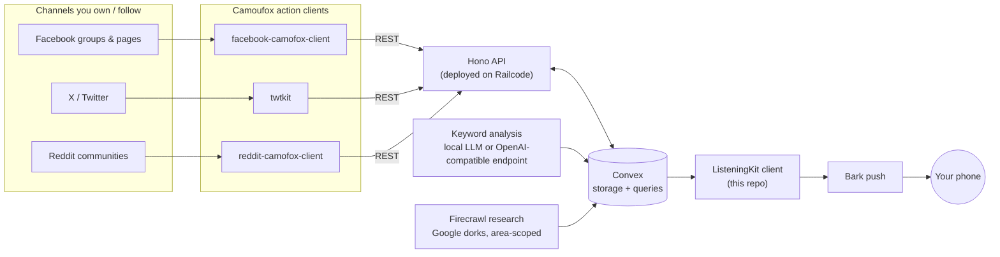
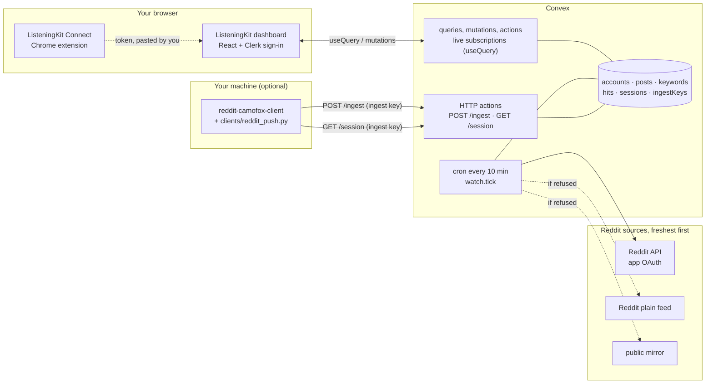
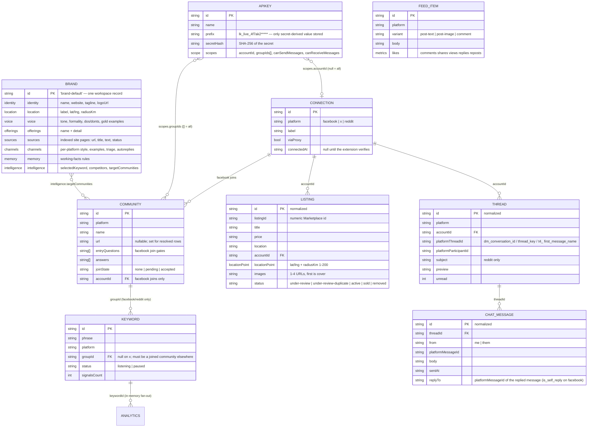
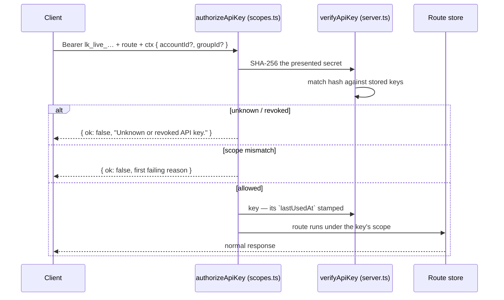
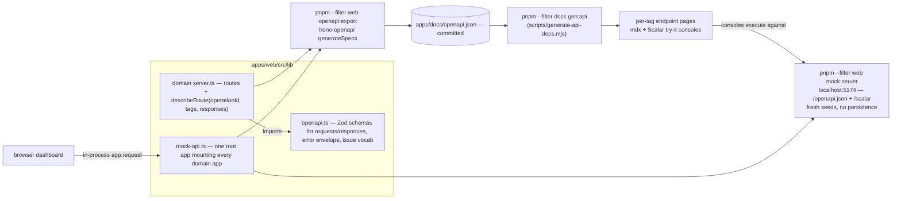
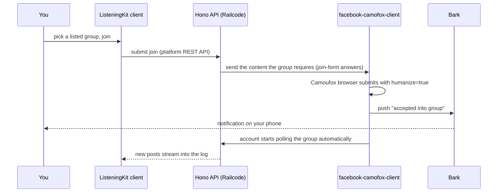
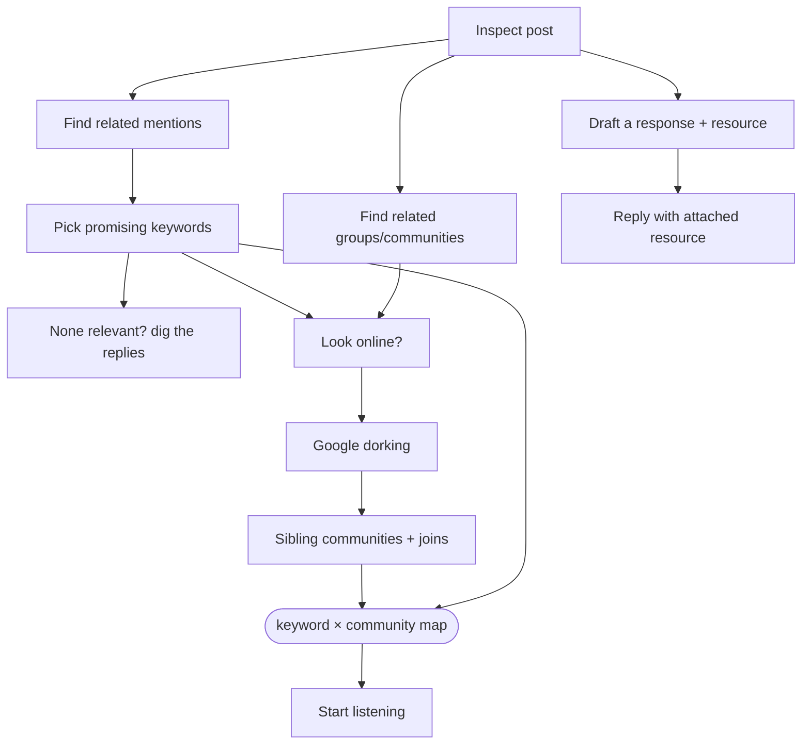
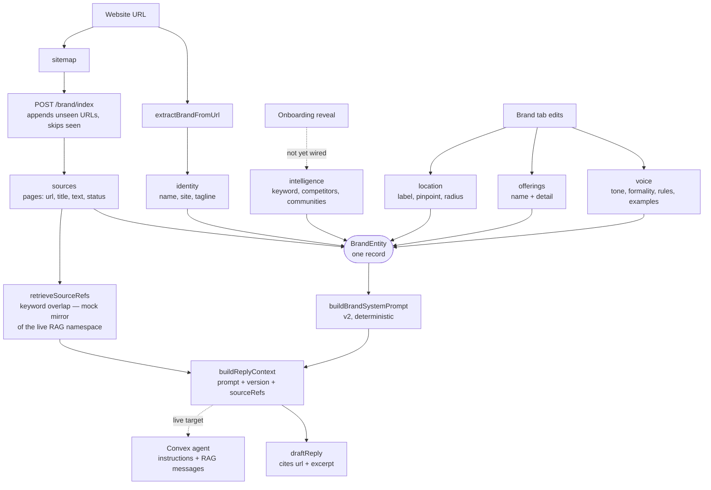
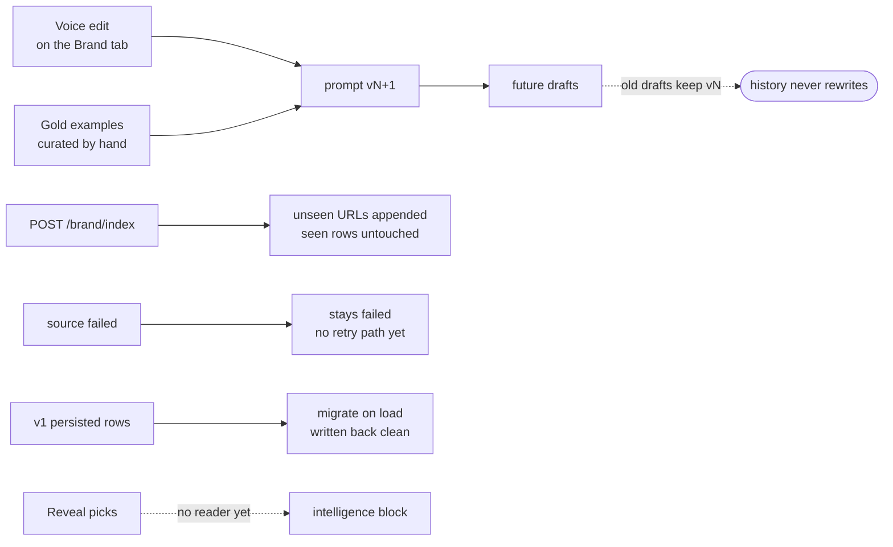

# ListeningKit Logbook

A live log of what's happening on the social channels that matter to your business — **Facebook, X (Twitter), and Reddit** — with push notifications the moment a word, keyword, or phrase you care about shows up in the channels you own, the groups you're a member of, and the communities you follow.

This is the **open-source client** for ListeningKit, a **Convex hackathon** submission. The stack is built directly on top of **OpenMagpie** — the open-source social-listening tool the team works on — and the shared Camoufox action clients described below.

## The goal, in one sentence

You tell ListeningKit what to listen for; it watches your accounts, groups, and communities for you, notifies you (Bark push) on hits, and can take action where it counts — including **joining the groups you want to be in**.

## How it fits together



| Piece | What it does |
|---|---|
| **Camofox action clients** | `facebook-camofox-client`, `twtkit`, `reddit-camofox-client` — hand-built REST APIs that expose the [Camoufox](https://github.com/daijro/camoufox) browser binary through its Playwright bindings with `humanize=true`. They don't just read — they **take action**: post, message, poll, and submit group-join forms. |
| **Hono API** | The single entry point the client talks to. Deployed directly on **Railcode**. |
| **Convex** | The backend — and the point of the hackathon submission. We're **dropping Postgres**: all indexed posts, keyword state, and account/connection state lives in Convex. |
| **Keyword analysis** | Unified analysis built on top of the tooling from contributor [@matthewdonsemail-lab](https://github.com/matthewdonsemail-lab), which ListeningKit is built on. Hits are scored by a **local LLM or any OpenAI-compatible endpoint**, then written to Convex. |
| **Community research (Firecrawl)** | Finds and curates communities **scoped by area** using [Firecrawl](https://firecrawl.dev) with Google search operators / dorking strategies, then curates against the stored, indexed posts across the communities and areas you're targeting. |
| **Bark** | [Bark](https://bark.app) push notifications — keyword hits and group-acceptance events land on your phone. |

## What's actually in this repo

Everything above is the **live target**; the client in this repo is built against the full API contract *today*, with the live clients stubbed by an in-repo mock that speaks the same route table. Concretely:

- The dashboard's data layer is a set of **Hono apps** under [`apps/web/src/lib/`](apps/web/src/lib/) — one per domain — mounted onto a single root app in [`mock-api.ts`](apps/web/src/lib/mock-api.ts), with mock-backed stores and seed data.
- The clients in each domain call the Hono apps **in-process** (`app.request(…)`), so the whole dashboard runs in the browser with no server. State that should survive a refresh persists to **localStorage**; everything else is in-memory per boot.
- The same root app also serves as a standalone **mock server** on `http://localhost:5174` ([`scripts/mock-server.ts`](apps/web/scripts/mock-server.ts)) with fresh seeds on every boot, which the docs' **Scalar try-it consoles** execute against.
- Pointing the clients at the live Hono/Railcode backend later is a **transport change only** — no route, response shape, or client call changes. The Vite dev server already proxies [`/api`](apps/web/vite.config.ts) to `http://localhost:4000` for that day.

## Current architecture (live, dev)

The dashboard talks to **Convex directly**. There is no bridge server on the live path. Reddit works end to end; X and Facebook can be connected but nothing reads them yet.



**One user's path, in plain words.** Sign in with Google (Clerk) → onboarding: watch the video, install the extension, paste a token → "What should we listen for?": type a phrase and pick a subreddit → a cron reads that subreddit every 10 minutes, matches every new post as a whole-word phrase, and the matches appear on screen live.

| Piece | What it does | Where |
|---|---|---|
| **Auth** | Clerk dev instance; the Clerk `convex` JWT is verified by Convex. Every function derives the owner from the token, never from an argument. | [`convex/auth.config.ts`](convex/auth.config.ts), [`convex/lib/server.ts`](convex/lib/server.ts) |
| **Feed** | Live `useQuery` subscription to `feed:list`; "Sync now" runs `reddit:syncSubreddit`. | [`DashboardFeed.tsx`](apps/web/src/components/DashboardFeed.tsx), [`convex/feed.ts`](convex/feed.ts) |
| **Keywords + matches** | Phrases scoped to a subreddit. Every ingested post is matched as it arrives; each (phrase, post) pair is one `hits` row. | [`keywords.ts`](convex/keywords.ts), [`hits.ts`](convex/hits.ts), [`lib/match.ts`](convex/lib/match.ts), [`DashboardKeywordsLive.tsx`](apps/web/src/components/DashboardKeywordsLive.tsx) |
| **Reddit reading** | Cron `watch.tick` reads each watched subreddit once, in order: official API (needs app creds) → Reddit plain feed → public mirror. Each phrase records when it was read and from where; the page shows "checked 4 min ago" and warns when the backup source answered. | [`watch.ts`](convex/watch.ts), [`reddit.ts`](convex/reddit.ts), [`lib/redditFeed.ts`](convex/lib/redditFeed.ts) |
| **AI scoring** | Each new match is scored 0-100 with an intent and a one-line reason by an action scheduled at ingest time (10-minute backfill cron as a safety net). Model call: OpenAI directly when `OPENAI_API_KEY` is set, else the Convex AI Gateway (paid Convex plans). Post text is treated as untrusted; replies are validated; `AI_SCORING=off` stops all calls. | [`scoring.ts`](convex/scoring.ts), [`lib/scoring.ts`](convex/lib/scoring.ts) |
| **Ingest door** | `POST /ingest` takes batches of posts for facebook, x or reddit, authenticated by a per-user ingest key (only its SHA-256 is stored). The owner comes from the key, not the request. | [`http.ts`](convex/http.ts), [`ingest.ts`](convex/ingest.ts) |
| **Connect an account** | The extension copies a token (`lk1.` + base64url JSON cookie jar) for the site you are logged in to. Pasting it calls `sessions:save`, which validates it in plain words, drops cookies outside the platform's domains, and seals the jar with AES-256-GCM. No query returns the jar to a browser. | [`apps/extension`](apps/extension), [`sessions.ts`](convex/sessions.ts), [`lib/token.ts`](convex/lib/token.ts), [`lib/crypto.ts`](convex/lib/crypto.ts) |
| **X helper** | `clients/x_push.py` runs on the person's own computer: loads their connected X login (`GET /session`), asks for their X phrases (`GET /phrases`), searches X through twikit for each exact phrase, and pushes tweets to `/ingest`. It spaces requests, stops when X asks it to slow down, and reports a refused login in plain words. Reading X this way uses X's private web API and can go against X's terms; use an account you can afford to lose. | [`clients/x_push.py`](clients/x_push.py), [`http.ts`](convex/http.ts) |
| **Local clients** | `GET /session?platform=` returns the owner's own decrypted jar to their ingest key, so a local adapter needs no cookies file. `reddit_push.py` polls reddit-camofox-client and pushes to `/ingest`. | [`clients/`](clients) |

### Security model
- **Owner isolation is structural.** `requireOwner(ctx)` runs in every public function; ingest keys resolve to an owner server-side.
- **Secrets never reach a browser or a log.** The jar is sealed with a key held only in deployment env (`SESSION_ENCRYPTION_KEY`); ingest keys are stored as hashes and shown once; error messages never echo cookie values.
- **The extension is minimal.** It requests cookies only for reddit.com, x.com, twitter.com and facebook.com, uses `activeTab` and `clipboardWrite`, and has no network permission.

### Environment
| Variable | Where | Purpose |
|---|---|---|
| `VITE_API_MODE=live`, `VITE_CONVEX_URL` | `apps/web/.env.local` | Use Convex directly. Unset `VITE_CONVEX_URL` falls back to the Hono bridge. Restart Vite after editing. |
| `VITE_CLERK_PUBLISHABLE_KEY` | `apps/web/.env.local` | Clerk sign-in. |
| `AUTH_ISSUER`, `AUTH_AUDIENCE` | Convex deployment env | Verify the Clerk JWT. |
| `SESSION_ENCRYPTION_KEY` | Convex deployment env | 32 random bytes, base64. Needed to connect accounts. |
| `OPENAI_API_KEY` | Convex deployment env | Scores matches with OpenAI (`AI_MODEL` overrides the default `gpt-4o-mini`; `AI_SCORING=off` disables). Optional; without it matches stay unscored. |
| `REDDIT_CLIENT_ID`, `REDDIT_CLIENT_SECRET` | Convex deployment env | Reddit "script" app for dependable freshness. Optional; without it the plain feed and mirror are used. |
| `LISTENINGKIT_INGEST_URL`, `LISTENINGKIT_INGEST_KEY` | local adapter shell | Where and how an adapter pushes (`reddit_push.py`, `x_push.py`). |

### What is real and what is still mock
Real on Convex: sign-in, feed, keywords, matches, scoring, the Reddit cron, ingest keys, connected accounts, and the ingest, session and phrases endpoints. X works through the helper above (not yet run against a real X account). Still the in-browser mock described above: messaging, listings, groups, brand, analytics, API keys, and the onboarding brand step. A Facebook helper, phone alerts (Bark) and Firecrawl discovery are on the to-do list in [`HANDOFF.md`](HANDOFF.md).

### Run it
```bash
pnpm install
pnpm exec convex dev --once --typecheck=disable          # push functions to the dev deployment
pnpm --filter web exec vite --port 3000                  # web, with VITE_API_MODE=live + VITE_CONVEX_URL set
python scripts/build-extension.py                        # rebuild the downloadable extension zip after editing apps/extension
```

## The API

One Hono surface, **8 tags, 55 documented operations** (the `/messaging/twitter` legacy alias is documented as its own five operations beside `/messaging/x`). Every route carries `describeRoute(...)`, and every request/response **Zod schema lives in one file** — [`openapi.ts`](apps/web/src/lib/openapi.ts) — so the generated spec, the docs site, and the mock can't drift from each other. The generated contract is committed at [`apps/docs/openapi.json`](apps/docs/openapi.json), and each tag page renders with a live try-it console: see the [API reference](apps/docs/content/docs/api-reference/index.mdx).

| Tag | Routes | Implementation | Docs |
|---|---|---|---|
| **API keys** | `GET/POST /api-keys`, `DELETE /api-keys/:id` | [`api/server.ts`](apps/web/src/lib/api/server.ts) | [page](apps/docs/content/docs/api-reference/endpoints/api-keys.mdx) |
| **Brand** | `GET/PUT/DELETE /brand`, `POST /brand/intelligence`, `POST /brand/index`, `GET/DELETE /brand/sources` | [`brand/server.ts`](apps/web/src/lib/brand/server.ts) | [page](apps/docs/content/docs/api-reference/endpoints/brand.mdx) |
| **Accounts** | `GET/POST /accounts`, `PATCH/DELETE /accounts/:accountId`, `POST /accounts/:accountId/resolve` (dashboard-only: 409 unless a challenge is pending) | [`connections/server.ts`](apps/web/src/lib/connections/server.ts) | [page](apps/docs/content/docs/api-reference/endpoints/accounts.mdx) |
| **Communities** | `GET /communities[?platform=]`, `POST /communities/:id/join`, `POST /communities/join-by-url`, `POST /communities/resolve`, `POST /communities/resolve-reddit`, `POST /communities/:id/accept`, `DELETE /communities/:id` | [`communities/server.ts`](apps/web/src/lib/communities/server.ts) | [page](apps/docs/content/docs/api-reference/endpoints/communities.mdx) |
| **Listings** | `GET/POST /listings`, `PATCH /listings/:listingId`, `PATCH /listings/:listingId/status`, `GET /listings/:listingId/status`, `DELETE /listings/:listingId` | [`listings/server.ts`](apps/web/src/lib/listings/server.ts) | [page](apps/docs/content/docs/api-reference/endpoints/listings.mdx) |
| **Keywords** | `GET /keywords[?platform=&groupId=&noGroup=]`, `POST /keywords`, `POST /keywords/reset`, `PATCH/DELETE /keywords/:id` | [`keywords/server.ts`](apps/web/src/lib/keywords/server.ts) | [page](apps/docs/content/docs/api-reference/endpoints/keywords.mdx) |
| **Feed** | `GET /feed[?platform=&search=]`, `GET /feed/:platform[?search=]` | [`feed/server.ts`](apps/web/src/lib/feed/server.ts) | [page](apps/docs/content/docs/api-reference/endpoints/feed.mdx) |
| **Messaging** | per platform at `/messaging/{facebook,x,reddit}`, plus the legacy `/messaging/twitter` alias of the `x` routes: `GET /threads`, `POST /threads`, `GET /threads/:threadId/messages`, `POST /threads/:threadId/messages`, `POST /threads/:threadId/ack` — 20 operations in the spec | [`messaging/routes.ts`](apps/web/src/lib/messaging/routes.ts) | [page](apps/docs/content/docs/api-reference/endpoints/messaging.mdx) |

### Data model

The mock's stores keep one record shape per domain; the foreign keys (account ids, community ids) are what tie the workspace together:



| Record | Defined in | Storage | Notes |
|---|---|---|---|
| `ApiKey` / `ApiKeyScope` | [`api/types.ts`](apps/web/src/lib/api/types.ts) | localStorage `api-keys`, seeded from [`api/mock.ts`](apps/web/src/lib/api/mock.ts) | Only the SHA-256 **hash** of the secret is ever stored; the plaintext exists for exactly one moment — the create response. |
| `ConnectionRecord` | [`connections/types.ts`](apps/web/src/lib/connections/types.ts) | localStorage `listeningkit.accounts.v2` via [`connections/store.ts`](apps/web/src/lib/connections/store.ts) | Id-keyed, not platform-keyed: multiple accounts per platform, optional per-account proxy. v1 rows migrate on load; stale platforms are filtered out. |
| `Community` | [`communities/types.ts`](apps/web/src/lib/communities/types.ts) | localStorage `communities.catalog` + `communities.joins` (merged on read by `materialize()`) | 20-row seed catalog ([`communities/mock.ts`](apps/web/src/lib/communities/mock.ts)); pasted Facebook URLs and typed subreddits register as first-class rows. |
| `Keyword` | [`keywords/types.ts`](apps/web/src/lib/keywords/types.ts) | localStorage `keywords`, seeded from [`keywords/mock.ts`](apps/web/src/lib/keywords/mock.ts) | X keywords are word-based (`groupId: null`); facebook/reddit keywords must scope to a **joined** community, checked live against the communities store. Duplicates 409 per scope. |
| `ListingRecord` | [`listings/types.ts`](apps/web/src/lib/listings/types.ts) | localStorage `listings` | 5 seed rows, including two live-verified marketplace captures; legacy rows without `accountId` migrate on load via `migrateListingRow`, which also backfills the normalized `id` — the native numeric `listingId` is preserved alongside it, and the normalized `id` is what the dashboard uses. |
| `FeedItem` | [`feed/mock.ts`](apps/web/src/lib/feed/mock.ts) | in-memory seed (10 rows) | Filterable by `?platform=` / `?search=`; metrics are numbers, formatted for display by `formatCount`. |
| `Thread` / `ChatMessage` | [`messaging/types.ts`](apps/web/src/lib/messaging/types.ts) | localStorage `messaging` — one per-platform/per-account map in [`messaging/store.ts`](apps/web/src/lib/messaging/store.ts) | Native platform ids are preserved alongside the normalized ones (see [Messaging](#messaging--the-full-chat-contract)); the normalized `id` is what the dashboard uses. |
| `BrandEntity` | [`brand/types.ts`](apps/web/src/lib/brand/types.ts) | localStorage `brand-entity` | One record per workspace (`brand-default`); v1 rows (string offerings, `voice.serviceAreas`) migrate to v2 on load. |
| `FirehoseEvent` + analytics shapes | [`analytics/types.ts`](apps/web/src/lib/analytics/types.ts) | in-memory, deterministic per keyword | No HTTP route on purpose: [`getKeywordAnalytics`](apps/web/src/lib/analytics/mock.ts) is consumed directly by the analytics pages, seeded from the keyword's UUID (14-day trend, 120 events, companion phrases for the follow-up chain). |
| `AccountIssue` / `IssueFix` | [`account-issues/types.ts`](apps/web/src/lib/account-issues/types.ts) | catalog-driven, not persisted | 26 normalized codes × 10 remediation verbs in [`account-issues/catalog.ts`](apps/web/src/lib/account-issues/catalog.ts); the three platform normalizers in [`account-issues/normalize.ts`](apps/web/src/lib/account-issues/normalize.ts) map raw signals (Graph code/subcode, X `type`, Reddit status/body) onto it. Human guide: [docs /getting-started/errors](apps/docs/content/docs/getting-started/errors.mdx). |

Cross-cutting persistence uses one guarded helper — [`persist.ts`](apps/web/src/lib/persist.ts) (`loadPersistedState` / `savePersistedState` with runtime shape checks, so a stale or malformed row falls back to seeds instead of crashing the store). Id generation is centralized the same way — [`ids.ts`](apps/web/src/lib/ids.ts) exports the single `uuid()` every domain mints opaque keys from, so no two stores can drift into colliding schemes. The canonical platform type `facebook | x | reddit` is defined once in [`platform.ts`](apps/web/src/lib/platform.ts) and reused by every domain.

### API keys & scopes

Keys are minted from the dashboard's API tab, never from the API: the `/api-keys` routes are dashboard-only, and **keys never mint or revoke keys**. Challenge resolution is dashboard-only the same way — `POST /accounts/:accountId/resolve` requires a human in the resolver view, so it stays out of the `API_ROUTES` registry and keys can never clear challenges. Model in [`api/types.ts`](apps/web/src/lib/api/types.ts):

- A key is `{ name, prefix, secretHash, scopes }` — the `prefix` (e.g. `lk_live_4f7ak2••••••••`) is the only secret-derived value lists ever show; the full secret is returned exactly once, in the `POST /api-keys` response.
- A scope is four dimensions: `accountId` (`null` = all accounts), `groupIds` (`[]` = all joined groups), `canSendMessages`, `canReceiveMessages`.

Authorization is table-driven. Every route an external key may call is declared in the [`API_ROUTES`](apps/web/src/lib/api/scopes.ts) registry (28 entries, no `planned` ones left — every declared route is implemented) with what that route **needs** from a key (`account`, `group`, `send`, `receive`); a route only checks the dimensions it names. `checkAccess` is pure (which is why the per-key activity firehose can replay recorded calls through it), and `authorizeApiKey` layers on secret verification:



The registry, the pure check, and the gate already exist and are shared: the dashboard's per-key **scope-activity firehose** is exactly `checkAccess` replayed over recorded calls ([`api/activity.ts`](apps/web/src/lib/api/activity.ts)), and the same check drives the scope visuals in the [key inspect form](apps/web/src/components/DashboardApiActivityInspectForm.tsx) — so what the UI shows is provably the logic the live gate runs. Wiring `authorizeApiKey` into the route handlers is the remaining cutover step when the live backend lands. Keys also carry **bits ahead of their routes**: an entry in the registry can be `planned` (`planned` in [`ApiRouteDef`](apps/web/src/lib/api/scopes.ts)), so a key minted today already has the permission when the route ships.

### The OpenAPI pipeline

Nothing about the API contract is authored twice:



- The **same Zod schemas** describe routes at runtime (`describeRoute`) and serialize to the spec via `z.toJSONSchema` — a schema change cannot silently desync the docs.
- The spec's **error vocabulary** is derived from the dashboard's own [`ISSUE_CATALOG` / `FIX_LABELS`](apps/web/src/lib/account-issues/catalog.ts): add a code to the catalog and it flows into `openapi.json` and the [Errors](apps/docs/content/docs/getting-started/errors.mdx) contract with no second authoring pass.
- The docs site (fumadocs, `apps/docs`) renders the committed spec and its generated per-tag pages; the [API reference index](apps/docs/content/docs/api-reference/index.mdx) explains the try-it setup. Regenerate after any route or schema change: `pnpm --filter web openapi:export` then `pnpm --filter docs gen:api`.

### Messaging — the full chat contract

Messaging is the most complete domain: every connected account gets an isolated inbox per platform, and the surface covers the whole of chat, not just reading.

- **One factory, three platforms** — [`messaging/routes.ts`](apps/web/src/lib/messaging/routes.ts) is `buildMessagingRoutes(platform)`, producing the same five operations on each platform; [`messaging/index.ts`](apps/web/src/lib/messaging/index.ts) mounts them at `/messaging/{facebook,x,reddit}` (with `/messaging/twitter` kept as a legacy alias of `/messaging/x`):
  - `GET /threads` — the account's threads, newest first
  - `POST /threads` — **compose**: the first message *is* the thread (201; no platform allows an empty conversation), 409 `thread_already_exists` if that participant's conversation already exists
  - `GET /threads/:threadId/messages` — the thread plus its full message list; any non-owning account gets **404, never a leak**
  - `POST /threads/:threadId/messages` — send into an existing thread (Zod-validated `SendInput`; image and reply-to supported; 400 on empty body or an unresolvable reply id)
  - `POST /threads/:threadId/ack` — idempotent mark-read
  - Every route requires `?accountId=` (400 without) — account isolation is a route rule, not a convention.
- **State** — [`messaging/store.ts`](apps/web/src/lib/messaging/store.ts) keeps per-platform/per-account maps, seeds them from the platform mocks, and recomputes `preview` / `updatedAt` / `unread` on every send or start; `resetMessagingStore()` exists for tests.
- **Thread ↔ message linkage** — every [`ChatMessage`](apps/web/src/lib/messaging/types.ts) carries its `threadId`, and each account slice keeps `messages: Record<threadId, ChatMessage[]>`; thread and message ids are opaque UUIDs v4 (`crypto.randomUUID()`, shared `messaging/uuid.ts` helper), independent of the thread and any participant name — so a rename can never collide or invalidate an id (seed ids are minted the same way at module load). Reads and writes resolve through the thread first: `getThreadMessages` yields nothing unless the thread exists under that account (→ 404), and `sendMessage` rejects a reply target that isn't in the same thread (400).
- **Identities** — [`messaging/identities.ts`](apps/web/src/lib/messaging/identities.ts) pins the mock's eleven user accounts (fb-personal, fb-galway-rubbish, fb-pacer, x-ops, x-listeningkit, …) with display names and avatar styling, plus a default inbox per platform.
- **Native ids, normalized on top** — the point of the mock is that it mirrors what the real unofficial browser clients actually see, so every `Thread` / `ChatMessage` carries the platform-native id beside the normalized one:
  - **X** — no conversation object in the shipped payloads; a DM is identified by the `dm_conversation_id` (`<senderId>-<participantId>`, two 19-digit user ids) carried on each `dm_event`.
  - **Facebook** — explicit conversation object: numeric conversation id (the `thread_key`), messages with `mid` ids and `from`/`to` participants, `reply_to` with `is_self_reply`.
  - **Reddit** — no conversation object at all; inbox/outbox listings are flattened messages the client groups by `first_message_name` (the `t4_` fullname of the thread's first message), with a PM `subject` line on the thread.
  
  The [messaging tests](apps/web/src/lib/__tests__/messaging.test.ts) pin these shapes as regressions (`^\d{19}-\d{19}$` thread ids on X, `^\d{13,17}$` on Facebook, `^t4_[a-z0-9]+$` on Reddit), and the per-field contract is in the [Messaging docs page](apps/docs/content/docs/api-reference/endpoints/messaging.mdx).
- **Dashboard** — [`DashboardMessages.tsx`](apps/web/src/components/DashboardMessages.tsx) renders per-account inboxes from the client helpers in [`messaging/index.ts`](apps/web/src/lib/messaging/index.ts) (`getThreads`, `getThreadMessages`, `sendMessage`, `startThread`, `acknowledgeThread`) — the same calls an API client would issue. Selection is URL-driven (`/dashboard/messages/:platform/:accountId/:threadId/:messageId`, every level optional): the view deep-links the first conversation on load, unknown segments redirect up instead of rendering a dead view, and clicking a bubble links that message (scroll + flash). Nothing is hardcoded in the view — every row comes from the seeded mock store through those client calls. When the inbox is empty, the selected account's own API state decides what shows: a resolvable challenge (`checkpointed`, `challenge_interstitial`, `captcha_html`) renders a gate linking to the dedicated resolver route (`/dashboard/accounts/:accountId/challenge`, same `ChallengeResolver` iframe the Accounts table docks); any other recorded issue links to the account page instead.

### Multi-account proxying

Connect **every account you own**, each with its own cookie and an optional proxy route. Accounts are **id-keyed** (not platform-keyed), so multiple accounts per platform are first-class, and traffic can be pinned to a per-account proxy for isolation. The store, cookie validation, and proxy normalization all live in [`lib/connections/`](apps/web/src/lib/connections/store.ts); the extension handshake side is documented at [docs /getting-started/chrome-extension](apps/docs/content/docs/getting-started/chrome-extension.mdx).

### Group discovery → join → auto-listen

Per platform you get **listings** of communities. On Facebook, listings drive the join flow end-to-end:



The join REST call returns the **actual content required to get into the group** (forms, questions); the respective platform client submits it through the humanized browser. Today that lifecycle runs against the mock's communities store — `none → pending → accepted`, where facebook joins require a connected account plus an answer to *every* entry question (reddit/x resolve straight to `accepted`), and `POST /communities/:id/accept` stands in for the admin ([`communities/server.ts`](apps/web/src/lib/communities/server.ts)). URL entry is first-class too: pasted Facebook group links (`resolve` / `join-by-url`) and typed subreddits (`resolve-reddit`) register unseen communities as catalog rows before anything else happens.

### Follow-ups — inspect → suggest → map

Every captured post opens an inspect sheet (`DashboardEventInspectForm`), and every inspect ends in the same question: what do we do about this? The follow-up loop answers it three ways — and all three feed one growing **map of keywords × communities**: the phrases worth listening for, and the places worth listening in.



| Action | Platforms | What happens |
|---|---|---|
| **Find related mentions** | all | `DashboardRelatedKeywordsForm`: the chain reads the post and its comments, suggests keywords, and asks which look promising. Continue moves on; "none of these are relevant" digs through the replies for a second round. Then: look online? → Google dorks → sibling communities → joins → the map → Start listening. |
| **Find related groups / communities** | facebook + reddit | `DashboardRelatedCommunitiesForm`: the same chain entered at the online search with the tracked phrase preset — dorking → joins → map. (X has no groups, so the action hides there.) |
| **Draft a response** | all | Inline panel: the post answered in the brand's voice, plus a suggested resource — a video, guide, or page built from the brand's own site matched to what the post is about — attachable to the draft before sending. |

#### How the chain works (client)

- `RelatedMentionsChain` renders the branching chain-of-thought in the `brand-blue` tone (blue rails/tracks, white-glyph icons, navy labels — `ChainOfThoughtStep` `tone` plus the matching `chain-joints` tone).
- [`lib/related-mentions.ts`](apps/web/src/lib/related-mentions.ts) owns the forward-only XState machine: `scanning → picking → (retrying → repicking)* → onlineAsk → searching → groups → mapReady → saving → saved` (a second rejection lands in the final `dismissed`; `onlineAsk` can skip straight to the map). Streaming phases are timer-driven in the component; the machine owns the interactive half — rejected picks accumulate in context so later rounds never re-offer them.
- Mock data that feeds it: [`lib/analytics/mock.ts`](apps/web/src/lib/analytics/mock.ts) (post templates carry the tracked `{phrase}` plus a companion `{related}` phrase; `eventComments` carries round-two phrases in the replies) and [`lib/brand/query.ts`](apps/web/src/lib/brand/query.ts) (`suggestKeywords`, `suggestAcross`, `suggestResource`, `draftReply`).
- Joins and keyword creation are real store calls, not stubs: `joinCommunity` / `joinCommunityByUrl` (+ `acceptCommunity` standing in for the group admin), and `createKeyword` scoped to joined groups — facebook/reddit phrases ride on a group, X phrases ride free.

#### The map, and where it's going

The map is the product of the loop: keywords that look worth listening to, pinned to the communities (this one plus newly joined ones) where they're actually said — built out post by post, round-robin, until it covers everything the brand cares about. Accounts do the listening; the same accounts do the responding, with brand-matched resources attached.

Direction, not built yet: expose each follow-up step as a callable surface — platform REST today, model context protocol tomorrow — so a keyword inspection can run end-to-end on its own: inspect the hit, suggest what else to listen for, find the groups that talk like that, join them, and draft the reply with the resource attached. The map is what keeps growing underneath.

#### Onboarding reveal — the first listening scope

Before keywords exist, the [onboarding reveal](apps/web/src/components/onboarding/BrandRevealStep.tsx) builds the initial scope: a forward-only XState machine ([`reveal/machine.ts`](apps/web/src/lib/reveal/machine.ts)) walks competitors → related keywords → keywords confirmed → familiar groups → interested groups, with inline retry self-loops — a *No* appends a retry round and re-asks in place, and the machine never goes backwards. Acceptance is recorded *where* the Yes happened: each step is stamped with its `…AcceptedAt` index (`-1` = the initial ask, `≥0` = the retry round). The content — questions, competitor sets, retry search sets, group sets — lives in [`reveal/flow.ts`](apps/web/src/lib/reveal/flow.ts); accepted picks persist locally through `saveKeywordMapping` (localStorage `keyword-strategy-mapping`). `POST /brand/intelligence` exists to fold the same discoveries into the brand's `intelligence` block (competitors deduped, communities merged by id, `selectedKeyword` overwrite), but neither the route nor the saved mapping has a reader yet — reveal → listening seeding is the next wiring step, the same exists-not-yet-wired shape as the scope gate.

## Brand — gathered info → agent context → self-healing

Everything the app knows about the business lives in one `BrandEntity` record ([`apps/web/src/lib/brand/`](apps/web/src/lib/brand/types.ts)). Four pipelines fill it (one still unwired), one compiler turns it into reply context — and prompt versioning keeps history honest as the record improves. Full contract: [docs /brand](apps/docs/content/docs/brand/index.mdx) (voice, channels, website indexing, agent context).



| Information gathered | Where it lives | How the agent uses it |
|---|---|---|
| Business name, site, tagline | `identity` | Sign-off, resource URLs built from the brand's own site |
| Tone, formality, dos/don'ts, gold replies | `voice` | Compiled verbatim into the system prompt |
| Services with one-line details | `offerings` | Quoted in replies, passed as tool/RAG context |
| Service area + pinpoint | `location` | Listings default, group scoping, reply area |
| Indexed site pages | `sources` | Retrieval corpus for `retrieveSourceRefs` (keyword overlap; the RAG namespace is the live target); drafts cite url + 160-char excerpt |
| Keyword, competitors, communities | `intelligence` | Holds reveal discoveries; nothing reads it into listening yet |
| Per-channel style, examples, triage, autoreplies | `channels` | `simulateOutbound` scores autoreplies + examples by word overlap, applies channel style, appends triage |

What loops back into the record today — and what doesn't yet:



Concretely: drafts are stamped with the prompt version that produced them (`ReplyContext.promptVersion`), so a voice edit upgrades future replies without rewriting history; v1 rows (string offerings, `voice.serviceAreas`) migrate to v2 on load. Still open loops: re-index never refreshes stale page text, failed rows have no retry, good replies aren't auto-saved as gold examples (examples are curated by hand on the Brand tab), and reveal picks don't flow into listening scope. The deterministic preview of what *exactly* would be sent first-touch is `simulateOutbound` in [`brand/prompt.ts`](apps/web/src/lib/brand/prompt.ts) — it scores the channel's enabled autoreplies and examples by word overlap against the lead context, applies the channel style, and appends the first triage step; the Brand tab renders the result as a real per-channel thread ([`cards/`](apps/web/src/components/cards)).

## Shell & design system

The app shell, sidebar, and pages live in [`apps/web/src/components/`](apps/web/src/components) — see **[DASHBOARD_DESIGN.md](DASHBOARD_DESIGN.md)** for the full design record (squircle system, continuous collapse, status vocabulary, hard rules). Shared primitives come from [`packages/ui`](packages/ui) (`select`, `table`, `badge`, `button`, `squircle`, `toast`). The docs site under [`apps/docs`](apps/docs) is fumadocs, embedded in the dashboard at `/dashboard/docs` (the Vite dev server proxies `/docs` and `/_next` to the docs app on 3001).

## Testing

`vitest` runs in-process against the same Hono apps the dashboard uses (`pnpm --filter web test`, 162 tests), the Convex functions run offline with `convex-test` (`pnpm test:backend`, 53 tests), and the Python pieces have their own suites:

- **Backend** (`convex/*.test.ts`): ingest keys and the `/ingest` endpoint, keyword rules, whole-word matching, hits and owner isolation, the scheduled poll, every Reddit source and the fallback order, token validation, sealing (round trip, wrong key, tampering), and the `/session` endpoint.
- **Web** (`apps/web/src/lib/__tests__`): API coverage of the mock, messaging contract, the live transport (feed, keywords, connected accounts, ingest keys), the extension-and-server token contract, onboarding, and auth routes. A developer's `.env.local` is blanked in tests so they stay hermetic.
- **Python** (`python -m pytest clients/tests`, 19 tests; reddit-camofox-client has 25): mapping, batching and retries, session fetching, and post-card extraction.
- **Real browser checks** were run by hand with Camoufox (the app) and Playwright's Chromium (the extension); they are not part of `pnpm test`.

## Quickstart

```bash
pnpm install
pnpm dev           # web on http://localhost:3000 + docs on http://localhost:3001
```

Useful extras:

```bash
pnpm --filter web mock:server    # same API over HTTP on http://localhost:5174 (/openapi.json, /scalar)
pnpm --filter docs dev           # the docs site on http://localhost:3001
pnpm --filter api dev            # live bridge on http://localhost:4000 (needs apps/api/.env.local)
pnpm exec convex dev --once      # push Convex functions to the dev deployment (no watch)
```

## Scripts

| Command | What it does |
|---|---|
| `pnpm dev` | web (3000) + docs (3001) side by side; the web server proxies `/api` → 4000 and `/docs`/`/_next` → the docs app |
| `pnpm build` | `pnpm -r build` across workspaces |
| `pnpm typecheck` | `pnpm -r typecheck` across workspaces |
| `pnpm lint` | `pnpm -r lint` across workspaces (oxlint, `@shadcn/lint` — see [available rules](https://github.com/shadcn-ui/lint/blob/main/README.md#rules)) |
| `pnpm --filter web test` | vitest run (API coverage + messaging contract + feed transport + auth routes) |
| `pnpm test:backend` | Convex suite via convex-test (offline, `convex/*.test.ts`) |
| `pnpm typecheck:backend` | `tsc -p convex/tsconfig.json` |
| `pnpm --filter api test` | bridge boundary tests (auth, routes, sync validation) |
| `pnpm --filter web mock:server` | standalone mock API on 5174 |
| `pnpm --filter web openapi:export` | regenerate `apps/docs/openapi.json` from the mock |
| `pnpm --filter docs gen:api` | regenerate the endpoint pages from the committed spec |
| `pnpm exec convex dev --once --typecheck=disable` | push Convex functions to the dev deployment |
| `pnpm exec convex run watch:tick` | run the Reddit poll once, by hand |
| `python scripts/build-extension.py` | rebuild `apps/web/public/listeningkit-extension.zip` from `apps/extension` |
| `python -m pytest clients/tests` | adapter tests |

## Layout

```
listeningkit-hackathon/
  apps/
    web/              # Vite React client (3000) — dashboard, onboarding, the in-repo mock API
      public/         # listeningkit-extension.zip (built by scripts/build-extension.py)
      scripts/        # mock-server.ts, export-openapi.ts
    extension/        # ListeningKit Connect — Chrome (Manifest V3) extension that copies a connection token
    api/              # Hono bridge (4000) — legacy transport, used only when VITE_CONVEX_URL is unset
    docs/             # fumadocs site (3001) — OpenAPI reference + brand/keywords guides
  convex/             # the backend: schema, functions, HTTP endpoints, cron, offline tests
    lib/              # match, token, crypto, redditFeed, posts, accounts helpers
  clients/            # local adapters that push into /ingest (reddit_push.py, listeningkit_ingest.py)
  packages/
    ui/               # @listeningkit/ui shared package
  scripts/            # build-extension.py
  HANDOFF.md          # current state and the to-do list
  manifest.yaml       # Railcode deploy manifest
  railcode.json       # Railcode project config
  pnpm-workspace.yaml
```

Nested repos kept out of this one (each has its own git history): `apps/reddit-camofox-client`, `apps/facebook-camofox-client`, `apps/twikit`.

Add a new app: copy `apps/web` to `apps/<name>`, rename `name` in its `package.json`, and `pnpm install`.

## Contributing

Contributors to this hackathon submission: [@matthewdonsemail-lab](https://github.com/matthewdonsemail-lab) · [@PACER1](https://github.com/PACER1) · [@deepmroot](https://github.com/deepmroot) · [@john11099](https://github.com/john11099)