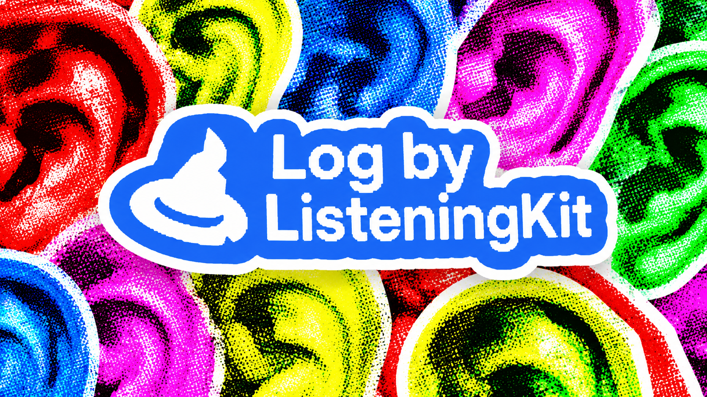
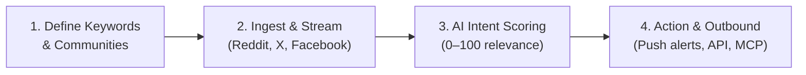
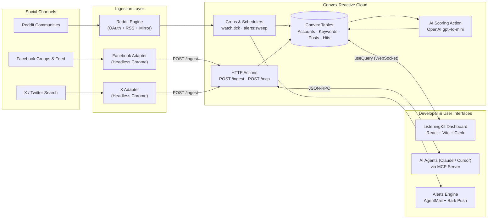

<p align="center">
  
</p>

# Log by ListeningKit

<p align="center">
  <a href="https://vibeapps.dev/judging/convex-all-gas-hackathon-openai/submit"></a>
  <a href="https://log.listeningkit.com"></a>
  <a href="LICENSE"></a>
  <a href="https://modelcontextprotocol.io"></a>
  <a href="https://convex.dev"></a>
</p>

## A Few Words from Matthew

> 🎥 **[Watch the Announcement Video on X](https://x.com/matthewsoldit/status/2102520314483941446)**
>
> *"I think that social listening and the tools around it should be open-sourced and that everyone should have access to it. We made this because we didn't want to pay money for something we think should be free!*
>
> *If you're coming across this and you want to be able to make good money from doing this at scale, send me a message on X: [**@matthewsoldit**](https://x.com/matthewsoldit).*
>
> *(also we build out really good CRMs and websites that convert — message me if you want to scale)*"  
> 
> — **Matthew** ([@matthewsoldit](https://x.com/matthewsoldit))

---

> **A real-time, omnichannel social media listening and marketing (SMM) engine.**  
> Monitor **Reddit**, **X (Twitter)**, and **Facebook** for the conversations, keywords, and buying signals that matter to your business — with instant push notifications, AI intent classification, outbound campaign automation, and full programmatic control via REST API and Model Context Protocol (MCP). Built as an open-source submission for the **Convex Hackathon**.

> **Live Deployment:** [https://log.listeningkit.com](https://log.listeningkit.com)  
> **Self-Hosting Guide:** [docs/self-hosting.md](docs/self-hosting.md)  
> **API & MCP Reference:** [docs/api-and-mcp.md](docs/api-and-mcp.md)  
> **Architecture Diagrams:** [docs/diagrams/](docs/diagrams/)  

---

## What is Log by ListeningKit?

**Log by ListeningKit** is an open-source social intelligence logbook that bridges social media networks with developer and AI workflows. Instead of manually scrolling feeds or paying thousands for enterprise social listening tools, Log streams relevant conversations directly to your screen, inbox, and AI agents.

### The Problem it Solves
Every single day, prospective customers actively discuss their problems and seek product recommendations online:
- Developers ask for open-source libraries on **Reddit** (`r/programming`, `r/webdev`).
- Founders share tool frustration and request alternatives on **X (Twitter)**.
- Local clients seek verified services inside niche **Facebook Groups**.

Most businesses miss 99% of these high-intent conversations because monitoring dozens of communities across three closed platforms is humanly impossible.

### How Log Works in 4 Steps


1. **You Tell It What Matters**: Add keywords, phrases, subreddits, or Facebook groups relevant to your brand or product.
2. **Autonomous Polling & Stream Ingestion**: The system continuously monitors channels (via official Reddit APIs/RSS and polite headless Chrome adapters for X and Facebook) and streams matching posts into Convex.
3. **AI-Powered Intent Scoring**: Incoming mentions are evaluated in real-time by an LLM (`gpt-4o-mini`) primed with your brand's unique value proposition. Every post receives a **relevance score (0–100)**, an **intent tag** (*Ready to buy*, *Needs recommendation*, *Casual*), and a one-sentence rationale.
4. **Instant Action & Outbound Campaigns**:
   - Get immediate mobile alerts (Bark) and email digests (AgentMail).
   - Programmatically interact via **REST API** and **Model Context Protocol (MCP)** with AI agents (Claude, Cursor, Hermes).
   - Discover sibling communities with Google dorking and join target Facebook groups autonomously with humanized form filling.

---

## Table of Contents

- [A Few Words from Matthew](#a-few-words-from-matthew)
- [What is Log by ListeningKit?](#what-is-log-by-listeningkit)
- [Hackathon Submission Highlights](#hackathon-submission-highlights)
- [Key Capabilities](#key-capabilities)
- [System Architecture](#system-architecture)
- [Domain Diagrams Gallery](#domain-diagrams-gallery)
- [Quickstart (3 Minutes)](#quickstart-3-minutes)
- [Self-Hosted Coding Version](#self-hosted-coding-version)
- [API & Model Context Protocol (MCP)](#api--model-context-protocol-mcp)
- [Documentation Directory](#documentation-directory)
- [Monorepo Layout](#monorepo-layout)
- [Testing & Quality](#testing--quality)
- [Contributing](#contributing)
- [License](#license)

---

## Hackathon Submission Highlights

This project was conceived, designed, and shipped as a submission for the **Convex Hackathon** (Convex + OpenAI):

- **Zero-Postgres Architecture**: All relational state, indexed posts, keyword matching rules, connection states, and vector-adjacent data live entirely inside [Convex](https://convex.dev) reactive database tables.
- **Real-Time Reactive UI**: Uses `useQuery` live subscriptions to render real-time post streams and hit updates instantly without polling or manual refreshes.
- **AI Scoring Pipeline**: Automatically evaluates inbound mentions against your brand's unique business context (scraped via Firecrawl) using OpenAI `gpt-4o-mini` with safety guardrails.
- **Built-in MCP Server**: Native `POST /mcp` JSON-RPC endpoint turning ListeningKit into autonomous tools for AI coding assistants.
- **Encrypted Zero-Leak Credentials**: Session credentials extracted by the companion Chrome extension are sealed using **AES-256-GCM** with keys stored strictly on the server.
- **Honest Ingestion**: Ingests real posts from official APIs, public feeds, and polite headless Chrome adapters with residential proxy failovers.

---

## Key Capabilities

| Capability | Platform / Technology | What It Does |
|---|---|---|
| **Social Listening** | Reddit, X, Facebook | Continuously scans channels for whole-word phrase occurrences with zero substring false positives. |
| **AI Scoring & Intent** | OpenAI, Convex Actions | Scores hits 0–100, assigns intent tags (*Ready to buy*, *Needs recommendation*, *Casual*), and provides one-sentence rationales. |
| **Brand Intelligence** | Firecrawl | Scrapes your website URL on onboarding to automatically extract brand voice, services, location, and target audiences. |
| **Instant Alerts** | AgentMail, Bark | Delivers consolidated plain-text email digests every 10 minutes and instant Bark push notifications to your mobile phone. |
| **Group Discovery** | Camoufox / Playwright | Discovers related Facebook groups, navigates multi-step membership entry questions, and joins them autonomously. |
| **AI Agent Interface** | MCP (`POST /mcp`) | Lets Claude, Cursor, and custom LLM agents query signals, create keywords, and execute outbound workflows. |

---

## System Architecture

ListeningKit decouples client interaction, serverless business logic, and browser automation into a resilient, event-driven topology:



Diagram source: [`docs/diagrams/system-overview.mmd`](docs/diagrams/system-overview.mmd)

---

## Domain Diagrams Gallery

All system architecture diagrams are separated by domain into dedicated `.mmd` files in the [`docs/diagrams/`](docs/diagrams/) directory:

| Domain | Diagram Title | Source File | Description |
|---|---|---|---|
| **System** | System Overview | [`system-overview.mmd`](docs/diagrams/system-overview.mmd) | End-to-end topology across sources, adapters, Convex, and alerts. |
| **Backend** | Convex Live Architecture | [`convex-architecture.mmd`](docs/diagrams/convex-architecture.mmd) | Reactive queries, background crons, HTTP doors, and fallbacks. |
| **Data Model** | Entity Relationship Diagram | [`data-model-erd.mmd`](docs/diagrams/data-model-erd.mmd) | Complete relational schema of accounts, keywords, hits, and brand. |
| **Security** | API Key Auth Sequence | [`api-auth-sequence.mmd`](docs/diagrams/api-auth-sequence.mmd) | Scoped authorization check and SHA-256 token verification. |
| **Contracts** | OpenAPI Pipeline | [`openapi-pipeline.mmd`](docs/diagrams/openapi-pipeline.mmd) | Single source of truth from Zod schemas to OpenAPI and docs. |
| **Automation** | Group Discovery & Join Flow | [`group-join-flow.mmd`](docs/diagrams/group-join-flow.mmd) | Multi-step form inspection, humanized browser submission, and alerts. |
| **Discovery** | Keyword Follow-up Loop | [`keyword-followup-loop.mmd`](docs/diagrams/keyword-followup-loop.mmd) | Post inspection chain, Google dorking, and keyword mapping. |
| **Brand** | Brand Context Pipeline | [`brand-context-pipeline.mmd`](docs/diagrams/brand-context-pipeline.mmd) | URL scraping, sitemap indexing, and LLM prompt context compilation. |
| **Brand** | Brand Feedback Loop | [`brand-feedback-loop.mmd`](docs/diagrams/brand-feedback-loop.mmd) | Voice upgrades, immutable history stamps, and index merges. |

👉 **View the complete interactive gallery in [docs/diagrams/README.md](docs/diagrams/README.md)**.

---

## Quickstart (3 Minutes)

Run the client immediately in **in-memory demo mode** (zero cloud configuration required):

```bash
# 1. Clone the repository
git clone https://github.com/matthewdonsemail-lab/log.git
cd log

# 2. Install dependencies
pnpm install

# 3. Start local development servers
pnpm dev
```

- **Dashboard UI**: [http://localhost:3000](http://localhost:3000)
- **Documentation**: [http://localhost:3001](http://localhost:3001)
- **Mock API & Scalar Console**: [http://localhost:5174/scalar](http://localhost:5174/scalar)

---

## Self-Hosted Coding Version

To run the complete self-hosted stack connected to your own Convex backend, live social media accounts, and AI models:

1. **Configure Convex**:
   ```bash
   npx convex login
   pnpm exec convex dev --once --typecheck=disable
   ```
2. **Set Environment Secrets**:
   ```bash
   pnpm exec convex env set SESSION_ENCRYPTION_KEY "$(openssl rand -base64 32)"
   pnpm exec convex env set AUTH_ISSUER "https://your-clerk-domain.clerk.accounts.dev"
   pnpm exec convex env set AUTH_AUDIENCE "convex"
   pnpm exec convex env set OPENAI_API_KEY "sk-..."
   pnpm exec convex env set PROXY_REQUIRED "false"
   ```
3. **Configure Web Client (`apps/web/.env.local`)**:
   ```ini
   VITE_API_MODE=live
   VITE_CONVEX_URL=https://your-deployment.convex.cloud
   VITE_CLERK_PUBLISHABLE_KEY=pk_test_...
   ```
4. **Connect Accounts via Chrome Extension**:
   ```bash
   python scripts/build-extension.py
   ```
   Load `apps/extension` into Chrome (`chrome://extensions`), log in to Reddit, X, or Facebook, and copy your session token.
5. **Start Local Python Ingestion Adapters**:
   ```bash
   python clients/x_push.py        # Monitors X / Twitter in real Chrome
   python clients/facebook_push.py # Monitors Facebook posts & groups
   ```

📖 **Read the step-by-step [Self-Hosting & Local Development Guide](docs/self-hosting.md)** for complete instructions, deployment options, and troubleshooting.

---

## API & Model Context Protocol (MCP)

ListeningKit exposes programmatic access for scripts, webhooks, and AI coding agents.

### MCP Server (`POST /mcp`)
Connect your AI assistant directly to ListeningKit tools:

```bash
# Claude Code CLI
claude mcp add listeningkit -- https://log.listeningkit.com/mcp --header "Authorization: Bearer lk_api_YOUR_KEY"
```

**Supported MCP Tools**:
- `get_plan`: Inspect active limits and platform quotas.
- `list_keywords`: Retrieve tracked keywords and signal counts.
- `list_matches`: Fetch scored social posts with cursor pagination and score filters.
- `get_match`: Fetch deep post content, AI sentiment, and author details.
- `add_keyword`: Programmatically create a keyword tracking rule.
- `set_keyword_status`: Pause or resume phrase monitoring.
- `remove_keyword`: Delete a keyword rule.

### REST API Reference
All REST endpoints are available under `/api/v1/`:
- `GET /api/v1/me` — Profile and plan limits
- `GET/POST /api/v1/keywords` — Manage tracked keywords
- `GET /api/v1/matches` — Query scored social signals
- `GET/POST /api/v1/webhooks` — Configure outbound HMAC-SHA256 webhooks

📖 **Read the full [Developer API & MCP Reference](docs/api-and-mcp.md)**.

---

## Documentation Directory

The codebase includes modular technical documentation organized under [`docs/`](docs/):

| Document | Link | Overview |
|---|---|---|
| **Self-Hosting Guide** | [`docs/self-hosting.md`](docs/self-hosting.md) | Complete guide for setting up Convex, Clerk, local adapters, and deployment. |
| **Architecture Reference** | [`docs/architecture.md`](docs/architecture.md) | Deep walkthrough of the reactive Convex engine, data model, and security boundaries. |
| **API & MCP Server** | [`docs/api-and-mcp.md`](docs/api-and-mcp.md) | REST endpoints, Model Context Protocol tools, and webhook signature verification. |
| **Features & Subsystems** | [`docs/features.md`](docs/features.md) | Social listening algorithms, AI scoring, Firecrawl brand extraction, and alerts. |
| **Architecture Diagrams** | [`docs/diagrams/`](docs/diagrams/README.md) | Gallery of 9 domain-separated Mermaid diagrams with `.mmd` source files. |
| **Contributing Guide** | [`docs/contributing.md`](docs/contributing.md) | Monorepo layout, linting rules, backend workflows, and testing standards. |

---

## Monorepo Layout

```
listeningkit-hackathon/
  apps/
    web/              # Vite + React + TS dashboard client (Port 3000)
      public/         # Static assets and extension download package
      src/            # Dashboard components, Zustand stores, in-memory mock API
    extension/        # ListeningKit Connect — Chrome (MV3) cookie extractor
    docs/             # Fumadocs documentation application (Port 3001)
    api/              # Hono bridge server (legacy fallback)
  convex/             # Convex backend: schema, functions, crons, HTTP actions
    lib/              # Business logic: matching, AES-256 crypto, scoring, tokens
  clients/            # Python local adapters (x_push.py, facebook_push.py)
  docs/               # Technical documentation, self-hosting guides, diagrams
    diagrams/         # Domain-separated Mermaid source files (.mmd)
  packages/
    ui/               # Shared @listeningkit/ui component library
  scripts/            # Packaging and deployment scripts
  banner.png          # ListeningKit project banner
  LICENSE             # MIT License
```

---

## Testing & Quality

ListeningKit maintains comprehensive test coverage across both frontend and backend suites:

```bash
# Run Convex backend tests offline (convex-test)
pnpm test:backend

# Run Web client Vitest tests
pnpm --filter web test

# Run Python adapter tests
python -m pytest clients/tests

# Run monorepo code linting
pnpm run lint
```

---

## Contributing

ListeningKit was created for the **Convex Hackathon** by:

- **Matthew Dons** ([@matthewdonsemail-lab](https://github.com/matthewdonsemail-lab))
- **PACER1** ([@PACER1](https://github.com/PACER1))
- **deepmroot** ([@deepmroot](https://github.com/deepmroot))
- **john11099** ([@john11099](https://github.com/john11099))

Contributions are welcome! Please review the [Contributing Guide](docs/contributing.md) and adhere to the guidelines in [AGENTS.md](AGENTS.md).

---

## License

This project is licensed under the **MIT License** — see the [LICENSE](LICENSE) file for details.

---

<!-- footer:offer-set:start -->
## Support

If this is useful, a star helps someone else find it.

[](https://github.com/matthewdonsemail-lab/log/stargazers)
[](https://github.com/matthewdonsemail-lab/log/network/members)
[](https://github.com/matthewdonsemail-lab/log/watchers)
[](https://github.com/matthewdonsemail-lab/log/commits)
[](https://github.com/matthewdonsemail-lab/log/blob/main/LICENSE)

[](https://github.com/matthewdonsemail-lab/log)
[](https://x.com/matthewdonsemail)
[](https://github.com/matthewdonsemail-lab/log/issues)
[](https://github.com/matthewdonsemail-lab/log/pulls)

## Star history

[](https://star-history.com/#matthewdonsemail-lab/log&Date)
<!-- footer:offer-set:end -->
