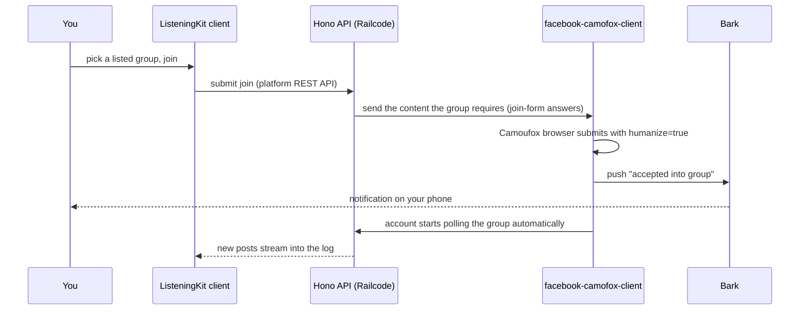
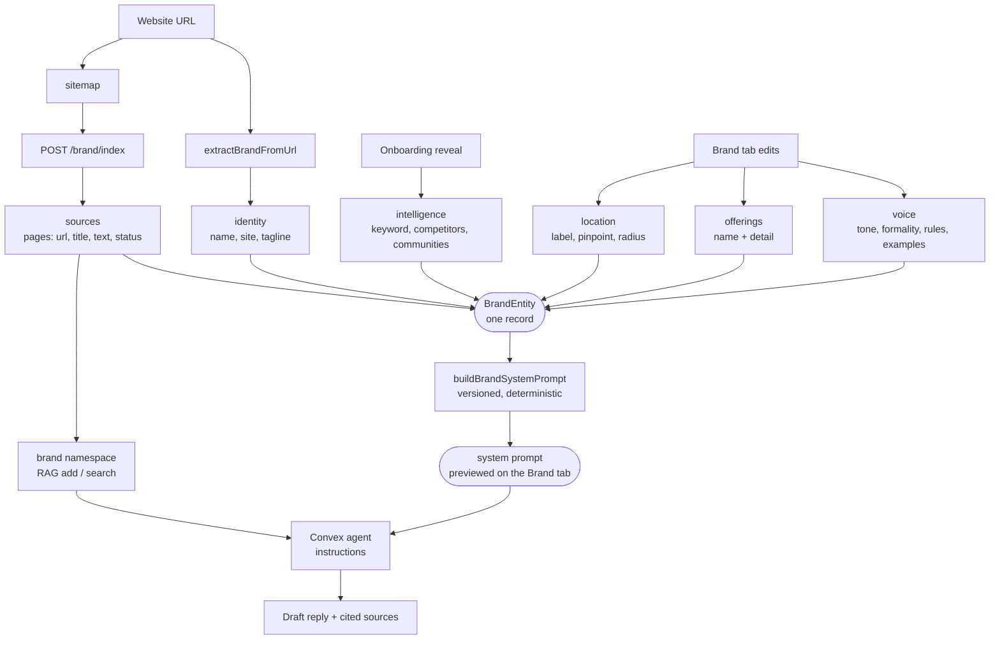
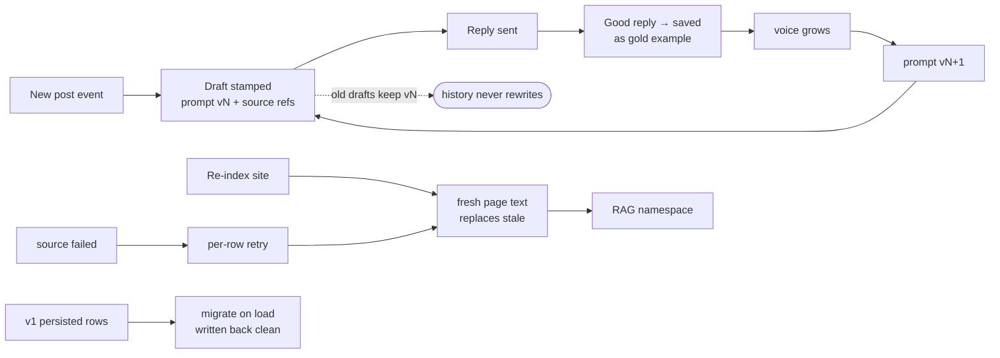

# ListeningKit Logbook

A live log of what's happening on the social channels that matter to your business — **Facebook, X (Twitter), and Reddit** — with push notifications the moment a word, keyword, or phrase you care about shows up in the channels you own, the groups you're a member of, and the communities you follow.

This is the **open-source client** for ListeningKit, a **Convex hackathon** submission. The whole stack is built directly on top of **OpenMagpie** — the open-source social-listening tool that the team works on — and on the shared Camoufox action clients below.

## The goal, in one sentence

You tell ListeningKit what to listen for; it watches your accounts, groups, and communities for you, notifies you (Bark push) on hits, and can take action where it counts — including **joining the groups you want to be in**.

## How it fits together


| Piece | What it does |
|---|---|
| **Camofox action clients** | `facebook-camofox-client`, `twtkit`, `reddit-camofox-client` — hand-built REST APIs that expose the [Camoufox](https://github.com/daijro/camoufox) browser binary through its Playwright bindings with `humanize=true`. They don't just read — they **take action**: post, message, poll, and submit group-join forms. |
| **Hono API** | The single entry point the client talks to. Deployed directly on **Railcode**. |
| **Convex** | The backend — and the point of the hackathon submission. We're **dropping Postgres**: all indexed posts, keyword state, and account/connection state lives in Convex. |
| **Keyword analysis** | Unified analysis built on top of the tooling from contributor [@matthewdonsemail-lab](https://github.com/matthewdonsemail-lab), which ListeningKit is built on. Hits are scored by a **local LLM or any OpenAI-compatible endpoint**, then written to Convex. |
| **Community research (Firecrawl)** | Finds and curates communities **scoped by area** using [Firecrawl](https://firecrawl.dev) with Google search operators / dorking strategies, then curates against the stored, indexed posts across the communities and areas you're targeting. |
| **Bark** | [Bark](https://bark.app) push notifications — keyword hits and group-acceptance events land on your phone. |

## Multi-account proxying

Connect **every account you own**, each with its own cookie and an optional proxy route. Accounts are **id-keyed** (not platform-keyed), so multiple accounts per platform are first-class, and traffic can be pinned to a per-account proxy for isolation. The client's connection store, connect/test handshakes, and duplicate-flow all live in `apps/web/src/lib/connections`.

## Group discovery → join → auto-listen

Per platform you get **listings** of communities. On Facebook, listings drive the join flow end-to-end:



The join REST call returns the **actual content required to get into the group** (forms, questions); the respective platform client submits it through the humanized browser.

## Follow-ups — inspect → suggest → map

Every captured post opens an inspect sheet (`DashboardEventInspectForm`), and every inspect ends in the same question: what do we do about this? The follow-up loop answers it three ways — and all three feed one growing **map of keywords × communities**: the phrases worth listening for, and the places worth listening in.


### The three follow-ups

| Action | Platforms | What happens |
|---|---|---|
| **Find related mentions** | all | `DashboardRelatedKeywordsForm`: the chain reads the post and its comments, suggests keywords, and asks which look promising. Continue moves on; "none of these are relevant" digs through the replies for a second round. Then: look online? → Google dorks → sibling communities → joins → the map → Start listening. |
| **Find related groups / communities** | facebook + reddit | `DashboardRelatedCommunitiesForm`: the same chain entered at the online search with the tracked phrase preset — dorking → joins → map. (X has no groups, so the action hides there.) |
| **Draft a response** | all | Inline panel: the post answered in the brand's voice, plus a suggested resource — a video, guide, or page built from the brand's own site matched to what the post is about — attachable to the draft before sending. |

### How the chain works (client)

- `RelatedMentionsChain` renders the branching chain-of-thought in the `brand-blue` tone (blue rails/tracks, white-glyph icons, navy labels — `ChainOfThoughtStep` `tone` plus the matching `chain-joints` tone).
- [`lib/related-mentions.ts`](apps/web/src/lib/related-mentions.ts) owns the forward-only machine: `scanning → picking → retrying → repicking → onlineAsk → searching → groups → mapReady → saving → saved` (a second rejection lands in `dismissed`). Streaming phases are timer-driven in the component; the machine owns the interactive half.
- Mock data that feeds it: [`lib/analytics/mock.ts`](apps/web/src/lib/analytics/mock.ts) (post templates carry the tracked `{phrase}` plus a companion `{related}` phrase; `eventComments` carries round-two phrases in the replies) and [`lib/brand/query.ts`](apps/web/src/lib/brand/query.ts) (`suggestKeywords`, `suggestAcross`, `suggestResource`, `draftReply`).
- Joins and keyword creation are real store calls, not stubs: `joinCommunity` / `joinCommunityByUrl` (+ `acceptCommunity` standing in for the group admin), and `createKeyword` scoped to joined groups — facebook/reddit phrases ride on a group, X phrases ride free.

### The map, and where it's going

The map is the product of the loop: keywords that look worth listening to, pinned to the communities (this one plus newly joined ones) where they're actually said — built out post by post, round-robin, until it covers everything the brand cares about. Accounts do the listening; the same accounts do the responding, with brand-matched resources attached.

Direction, not built yet: expose each follow-up step as a callable surface — platform REST today, model context protocol tomorrow — so a keyword inspection can run end-to-end on its own: inspect the hit, suggest what else to listen for, find the groups that talk like that, join them, and draft the reply with the resource attached. The map is what keeps growing underneath.

## Brand — gathered info → agent context → self-healing

Everything the app knows about the business lives in one `BrandEntity` record (`apps/web/src/lib/brand/`). Four pipelines fill it, one compiler turns it into agent context, and every loop back into the record is what makes it self-healing.



| Information gathered | Where it lives | How the agent uses it |
|---|---|---|
| Business name, site, tagline | `identity` | Sign-off, resource URLs built from the brand's own site |
| Tone, formality, dos/don'ts, gold replies | `voice` | Compiled verbatim into the system prompt |
| Services with one-line details | `offerings` | Quoted in replies, passed as tool/RAG context |
| Service area + pinpoint | `location` | Listings default, group scoping, reply area |
| Indexed site pages | `sources` | RAG namespace content; drafts cite url + excerpt |
| Keyword, competitors, communities | `intelligence` | Seeds keywords/groups listening |

Self-healing — the record repairs and improves itself without re-onboarding:



Concretely: drafts record the prompt version that produced them, so a voice edit upgrades future replies without rewriting history; re-index swaps stale page text in place while failed rows stay visible with retry; v1 rows (string offerings, `serviceAreas`) migrate to v2 on load; accepted competitors/keywords/communities flow back into listening scope, which produces new events, which produce new drafts. Each loop leaves the record richer than it found it. Full contract in [`apps/docs/content/docs/brand/`](apps/docs/content/docs/brand/).

## This repo — the client architecture

The important part of the architecture lives in `apps/web/src/lib/`. Every data surface is a **Hono-shaped API** — mock-backed today, same routes and response shapes when pointed at the real Hono/Railcode backend, so the client never changes.

### [`lib/connections/`](apps/web/src/lib/connections) — accounts & proxies

| File | Responsibility |
|---|---|
| [`types.ts`](apps/web/src/lib/connections/types.ts) | `ConnectionPlatform` (`facebook \| x \| reddit`), id-keyed `ConnectionRecord { id, platform, label, viaProxy, connectedAt }`, `ConnectInput` |
| [`store.ts`](apps/web/src/lib/connections/store.ts) | `listeningkit.accounts.v2` persistence, v1→v2 migration, first-run seeding, strict record validation (stale platforms are filtered out on read) |
| [`index.ts`](apps/web/src/lib/connections/index.ts) | `connectAccount` (handshake + persist), `testConnection` (dry-run), `disconnectAccount`, and the store re-exports — all `AbortSignal`-aware with fake-latency delays that mirror the real backends |
| [`cookie.ts`](apps/web/src/lib/connections/cookie.ts) / [`proxy.ts`](apps/web/src/lib/connections/proxy.ts) | Cookie validation and proxy-URL normalization shared by test + connect |

### [`lib/feed/`](apps/web/src/lib/feed) — the log

| File | Responsibility |
|---|---|
| [`server.ts`](apps/web/src/lib/feed/server.ts) | Hono-shaped feed app: `GET /feed`, `GET /feed/:platform` — mock rows today, real backend tomorrow, same contract |
| [`mock.ts`](apps/web/src/lib/feed/mock.ts) | Seed rows for the three platforms |
| [`index.ts`](apps/web/src/lib/feed/index.ts) | Client that requests through the Hono app |

Rendered in `DashboardFeed` as per-platform columns with real platform card layouts (post-text, post-image, comment).

### [`lib/messaging/`](apps/web/src/lib/messaging) — in-app messaging

Mirror of the feed pattern: a Hono app per platform ([`facebook/server.ts`](apps/web/src/lib/messaging/facebook/server.ts), [`twitter/server.ts`](apps/web/src/lib/messaging/twitter/server.ts), [`reddit/server.ts`](apps/web/src/lib/messaging/reddit/server.ts)) mounted at `/facebook`, `/twitter`, `/reddit` by [`index.ts`](apps/web/src/lib/messaging/index.ts), which aggregates `getThreads()` across all three. Shared shapes in [`types.ts`](apps/web/src/lib/messaging/types.ts) (`Thread`, `ChatMessage`, `Participant`).

### [`lib/notifications/bark.ts`](apps/web/src/lib/notifications/bark.ts) — push

Bark client: configurable server (defaults to `https://api.day.app`), device-key validation, a GET-form **test URL** (open it directly — no CORS), and `sendBarkPush` (POST JSON; Bark returns HTTP 200 even on failure, so the response `code` is what decides). Config persists to `listeningkit.bark.v1`.

### [`lib/communities.ts`](apps/web/src/lib/communities.ts) & [`lib/social-icons.tsx`](apps/web/src/lib/social-icons.tsx)

Community directory model (the listings the Groups screen joins/leaves, persisted to `listeningkit.joined.v1`), and the shared social identity: `simple-icons` paths for the three platforms plus the two-layer squircle `SocialBadge` used across header and tables.

### Shell & design system

The app shell, sidebar, and pages live in [`apps/web/src/components/`](apps/web/src/components) — see **[DASHBOARD_DESIGN.md](DASHBOARD_DESIGN.md)** for the full design record (squircle system, continuous collapse, status vocabulary, hard rules). Shared primitives come from [`packages/ui`](packages/ui) (`select`, `table`, `badge`, `button`, `squircle`, `toast`).

## Quickstart

```bash
pnpm install
pnpm dev        # runs apps/web on http://localhost:3000, proxies /api -> http://localhost:4000
```

## Scripts

| Command | What it does |
|---|---|
| `pnpm dev` | dev server for `apps/web` |
| `pnpm build` | `pnpm -r build` across workspaces |
| `pnpm typecheck` | `pnpm -r typecheck` across workspaces |
| `pnpm lint` | `pnpm -r lint` across workspaces |

## Layout

```
listeningkit-hackathon/
  apps/
    web/              # Vite React client (port 3000)
  packages/
    ui/               # @listeningkit/ui shared package
  pnpm-workspace.yaml
```

Add a new app: copy `apps/web` to `apps/<name>`, rename `name` in its `package.json`, and `pnpm install`.

## Contributing

Contributors to this hackathon submission: [@matthewdonsemail-lab](https://github.com/matthewdonsemail-lab) · [@PACER1](https://github.com/PACER1) · [@deepmroot](https://github.com/deepmroot) · [@john11099](https://github.com/john11099)