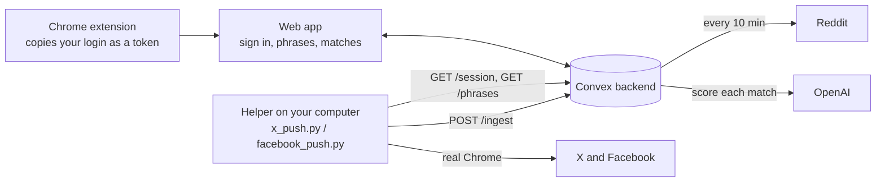

# Guide overview

ListeningKit watches Reddit, X and Facebook for the phrases your customers use ("need a bookkeeper", "switching accountants"), and shows you the posts that match, each scored from 0 to 100 for how likely the writer is to buy.

The live app is at **https://tremendous-seahorse-330.convex.site**.

<Callout type="info">
The rest of this docs site was written for an earlier mock-based design. This **Guide** section describes what is running today. Where another page disagrees with the Guide, trust the Guide.
</Callout>

## What works today

| Platform | How it is read | Where it runs | Status |
|---|---|---|---|
| Reddit | The server checks the community you chose every 10 minutes (Reddit's official API when configured, otherwise the public feed, otherwise a mirror that can be hours old). | Convex | Works end to end. |
| X | A small helper on your own computer searches X in real Chrome with your connected login and sends the posts to the app. | Your computer | Works. Tested with a real throwaway account. |
| Facebook | The same helper pattern: it searches Facebook's recent posts in real Chrome. It sees only what your account can see (public posts and groups you have joined). | Your computer | Works. Tested with a real throwaway account. |

Match scoring uses OpenAI and switches on when an `OPENAI_API_KEY` is set on the server. Without it, matches are shown unscored.

Still mock (in-browser demo data, not real): messaging, community listings and joins, the brand step, analytics and API keys. See [HANDOFF.md](https://github.com/matthewdonsemail-lab/log/blob/main/HANDOFF.md) for the full to-do list.

## How the pieces fit

- Your **login** for a platform is captured by the extension, sent once, and stored **encrypted** on the server. It is never sent back to a browser. Only a helper that holds your ingest key can fetch it.
- Reddit is read by the server. X and Facebook are read by **your computer**, because those sites are not readable from a server without getting blocked.

## Which page to read

<Cards>
<Card title="Using ListeningKit" href="/docs/guide/using-listeningkit">
  For users: sign in, connect a platform, add a phrase, read your matches.
</Card>

<Card title="X and Facebook helpers" href="/docs/guide/helpers">
  Run the helper that reads X and Facebook on your computer.
</Card>

<Card title="For developers" href="/docs/guide/developers">
  Set up the repo, run the tests, deploy, and add or debug a platform.
</Card>
</Cards>
