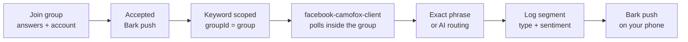

<Callout type="warning">
This page describes an earlier design of ListeningKit, built on an in-browser demo, so parts of it do not match the app that runs today. For what works now, read the [Guide](/docs/guide).
</Callout>

# Facebook keywords

Facebook keywords listen **inside one joined group**. There is no platform-wide Facebook listening: a keyword without a joined `groupId` is rejected (`400 — Facebook keywords must be scoped to a joined group`), because the client can only poll places your account is actually a member of.

## Join first, listen second

The scope has to exist before the keyword does. Joining is a real flow, not a bookmark:

1. Pick a listed group and send the join through one of your connected Facebook accounts, with answers to the group's entry questions.
2. The `facebook-camofox-client` submits the join form through a humanized Camoufox browser. The mock admin accepts on the spot; live, the group's admins accept and a Bark push tells your phone you're in.
3. Only then does `createKeyword({ phrase, platform: "facebook", groupId })` succeed — the API checks the group is `accepted` before it writes the row.

Joins are account-attributed: the seed data has `facebook-dallas-homeowners` accepted through one connected account and `facebook-texas-trades` sitting at `pending`, which is exactly the "waiting on the group" state a fresh join shows before acceptance.

## Polling inside the client

Once scoped, the account that joined does the listening. The client polls the group's posts through the same browser session — new posts stream into the log, phrase hits are matched (exact first, then the AI route), and hits land on your phone via Bark. Leave the group or lose membership and polling degrades to "content not available" instead of posts; the keyword row itself is untouched, so re-joining resumes listening without recreating anything.

## Seed reference

| Phrase | Status | Scope | Signals |
|---|---|---|---|
| `plumber needed` | listening | Dallas Homeowners — `Leaks, repairs and contractor referrals across Dallas–Fort Worth` (48k members) | 14 |

It reads the way a real listening row should: a two-word trade phrase, scoped to the busiest homeowners group, already pulling signals.

## Best practices (Facebook)

1. **Join before you keyword.** The API enforces it, but the habit matters more: an unjoined scope is a silent keyword.
2. **Answer entry questions properly.** Sparse answers stall at `pending` — and a pending group hears nothing.
3. **One row per group.** `plumber needed` in Dallas Homeowners and DIY Plumbing Help is two rows with two analytics pages; compare them instead of merging them.
4. **Keep the joining account connected.** Polling rides that account's session — if it disconnects, every keyword scoped through it goes quiet. The account health badges on the Keywords table show this before you feel it.
5. **Mind private-group etiquette.** You are listening as a member. Lurk first, match the group's tone in replies, and never scrape member lists — the client polls posts, nothing more.
