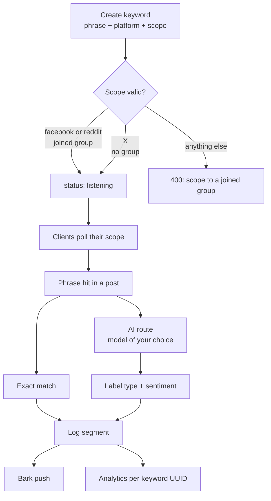

# Keywords

You tell ListeningKit what to listen for; it watches the channels for you and pushes a notification the moment a word, keyword, or phrase you care about shows up. A keyword is one record:

```ts
Keyword {
  id: string        // UUID — keys the analytics page
  phrase: string    // e.g. "plumber needed"
  platform: "facebook" | "x" | "reddit"
  status: "listening" | "paused"
  signalsCount: number
  groupId: string | null  // scope — see below
}
```

`status` is a pause switch, not a delete: pausing keeps the phrase, its signal history, and its analytics page. Deleting removes the row for good.

## Scope: everywhere vs one community

Where a keyword listens depends on the platform. Facebook and Reddit keywords are **scoped to one joined community** through `groupId` — to listen in two groups you create two keyword rows (the follow-up chains do exactly this: one `createKeyword` per phrase × scope). X keywords are **scoped everywhere**: they carry no group (`groupId: null`) and poll the whole platform.

| Platform | Scope | Rule enforced by the API |
|---|---|---|
| Facebook | One joined group | `groupId` required, and the group must be joined — otherwise `400` |
| Reddit | One joined subreddit | Same rule as Facebook |
| X (Twitter) | Everywhere | `groupId` must be `null` — sending one is a `400` |

Duplicates are rejected per scope (`409`): the same phrase twice in one group is one row, but the same phrase in two groups is two rows.



## The seed set

A fresh workspace ships with three keywords so every page reads populated. They mirror the mock rows in `apps/web/src/lib/keywords/mock.ts`:

| Phrase | Platform | Status | Scope | Signals |
|---|---|---|---|---|
| `plumber needed` | facebook | listening | Dallas Homeowners (joined) | 14 |
| `handyman near me` | x | listening | Everywhere (no group) | 7 |
| `house cleaning tips` | reddit | paused | r/Plumbing (joined) | 3 |

Each seed's `id` is a UUID: the analytics view keys off it, so the id you see in the route (`/dashboard/analytics/:keywordId`) is the same id the live client assigns. The facebook and reddit seeds point at communities the seed joins already hold (`facebook-dallas-homeowners` and `reddit-plumbing` are `accepted`); the X seed rides free.

<Callout type="warning">
Wiped them with the delete button? The Keywords page shows **Restore sample keywords** in the empty state — it rebuilds exactly this base set.
</Callout>

## Exact matching vs AI routing

Every hit starts the same way: the phrase appears in a captured post. What happens next has two lanes.

**Exact matching** is the gate: the phrase, case-insensitive, occurs in the post text. It is fast, predictable, and sufficient when the phrase is unambiguous (`valve replacement` means one thing). This is why the best-practice phrases below skew specific and multi-word.

**AI routing** is the judge: the hit is scored in context by a model of your choice — a local LLM by default, or any OpenAI-compatible endpoint. The model answers the question exact matching cannot: *is this post actually about the job, or just the words?* (`plumber` the movie vs `plumber` the trade; `flooded` with praise vs `flooded` with fury.) Anything the model clears is written to Convex; anything it rejects never becomes a signal.

Routing through the model is also what **labels and segments the log**. Every cleared hit carries:

- a **type label** — `mention`, `question`, `complaint`, or `praise` — which is how the console groups the firehose and how the inspect sheet picks its follow-ups;
- a **sentiment slice** — `positive`, `neutral`, or `negative` — the little status dot on each row.

So the log you read is not a grep dump: it is the model's segmentation of what was said, per keyword, per scope. Pause the keyword and the segmentation freezes with it; resume and polling picks up where it left off.

## Best practices (all platforms)

1. **Prefer two-to-three-word phrases.** Single common words (`water`, `heater`) match everything; the candidates the app itself suggests are bigrams for this reason.
2. **One intent per keyword.** `leak repair` and `boiler service` are two rows, even in the same group — separate rows get separate analytics pages and separate pause switches.
3. **Scope deliberately.** Facebook and Reddit rows are per-group: put the phrase where it is actually said. X rows run everywhere, so qualify them (`handyman near me` beats `handyman`).
4. **Pause, don't delete,** to stop listening temporarily. The signals, the scope, and the analytics history survive.
5. **Let duplicates stay rejected.** A `409` means that phrase × scope already exists — edit that row instead of working around it.

Platform specifics — including how polling works inside each client — live on the per-platform pages: [Facebook](/docs/keywords/facebook), [X](/docs/keywords/x), [Reddit](/docs/keywords/reddit).
