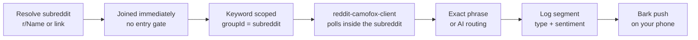

# Reddit keywords

Reddit keywords listen **inside one joined subreddit**, under the same rule as Facebook: `groupId` required, and the subreddit must be joined, or the API answers `400`. The difference is the join itself — subreddits don't gate entry, so resolving one joins it immediately.

## Resolve, join, listen

Paste `r/Name`, a bare name, or a full `reddit.com/r/Name` link and the client resolves it to a tracked community. Unknown names register on the spot and arrive already `accepted` — there are no entry questions to answer and no admin wait. The seed data shows both sides of this: `reddit-plumbing` sits at `accepted` with no account attached (Reddit joins carry no account, unlike Facebook's account-attributed joins).

Polling then works like Facebook's: the `reddit-camofox-client` polls the subreddit's posts through its browser session, hits match exact-first then AI-routed, and cleared hits segment into the log with type + sentiment.

## Seed reference

| Phrase | Status | Scope | Signals |
|---|---|---|---|
| `house cleaning tips` | paused | r/Plumbing — `“Is this supposed to drip?” — asked daily, answered hourly` (890k members) | 3 |

It is `paused`, which is the point of the seed: pausing freezes listening while keeping the 3 signals, the scope, and the analytics page. Resume flips it back to `listening` with nothing recreated.

## Best practices (Reddit)

1. **Scope per subreddit.** Big general rooms (`r/HomeImprovement`) and trade rooms (`r/Plumbing`) say the same words about different jobs — one row per subreddit keeps their analytics pages honest.
2. **Resolve by name, not by memory.** Use the resolve flow (`r/Name` or full link) so the scope id is canonical; near-miss names create near-miss scopes.
3. **Read the room before replying.** Subreddits punish drive-by promotion harder than Facebook groups. The inspect sheet's reply drafts are brand-voiced, but the account posting them should have comment history in the room first.
4. **Pause seasonally.** Trade subreddits are seasonal (`furnace service` sleeps in July). Pause instead of delete — the scope and history wait for the season to come back.
5. **Pair the X row.** A platform-wide X phrase plus a subreddit-scoped twin is the standard coverage pair: X catches it first, the subreddit shows the real thread.
