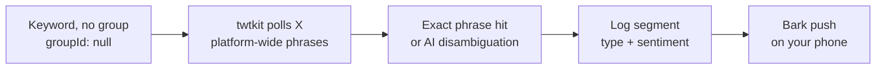

<Callout type="warning">
This page describes an earlier design of ListeningKit, built on an in-browser demo, so parts of it do not match the app that runs today. For what works now, read the [Guide](/docs/guide).
</Callout>

# X (Twitter) keywords

X keywords are scoped **everywhere**. There are no groups to join and no `groupId` to set — the API rejects one outright (`400 — X keywords are word-based and have no group`). Phrases are combinable words the client polls across the whole platform, which is also why the "find related groups" action hides on X: there is nothing to join.

## Polling with twtkit

`twtkit` is the X action client: a hand-built REST API over the Camoufox browser binary (Playwright bindings, `humanize=true`). For listening it polls your exact phrases across X search — the same surface a person typing the phrase into X search would see — and streams matching posts into the log. Because the scope is the entire platform rather than one group's walls, volume is higher and context is thinner than community-scoped listening, which is exactly where the matching lanes split their work:

- **Exact matching** catches the phrase wherever it appears (`handyman near me` in any post, any crowd).
- **AI routing** disambiguates what the platform context cannot: same words, different meaning, different sentiment. Cleared hits get their type label (`mention` / `question` / `complaint` / `praise`) and sentiment slice, so the firehose still reads segmented rather than raw.

## Seed reference

| Phrase | Status | Scope | Signals |
|---|---|---|---|
| `handyman near me` | listening | Everywhere (no group) | 7 |

Note the shape: a qualified, word-based phrase with a place intent (`near me`) rather than a bare trade word. Bare `handyman` would match hiring posts, jokes, and bios platform-wide; the qualifier is what keeps the 7 signals relevant.

## Best practices (X)

1. **Qualify every phrase.** No group walls means no free context — add the place, trade, or intent words (`near me`, `needed`, `recommendations`) that a group name would otherwise provide.
2. **Expect volume, segment ruthlessly.** Platform-wide polling pulls more posts; lean on the type + sentiment segmentation (and pause fast) instead of narrowing after the fact.
3. **One intent per keyword.** Same rule as everywhere, but it bites harder here: a broad X phrase is a firehose, a specific one is a feed.
4. **Watch for drift.** Slang and memes colonize trade words on X faster than in homeowner groups. When the log's sentiment mix shifts without new business, re-read the phrase and re-qualify it.
5. **Combine with community scopes elsewhere.** An X hit tells you *what* is being said platform-wide; a Facebook or Reddit row for the same phrase tells you *where the thread lives*. The keyword × community map grows by pairing them.
