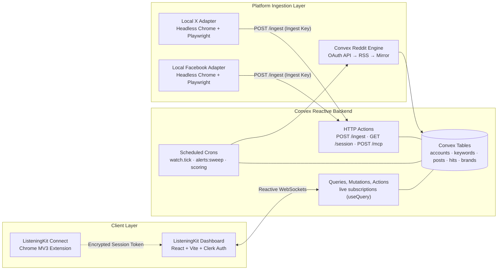
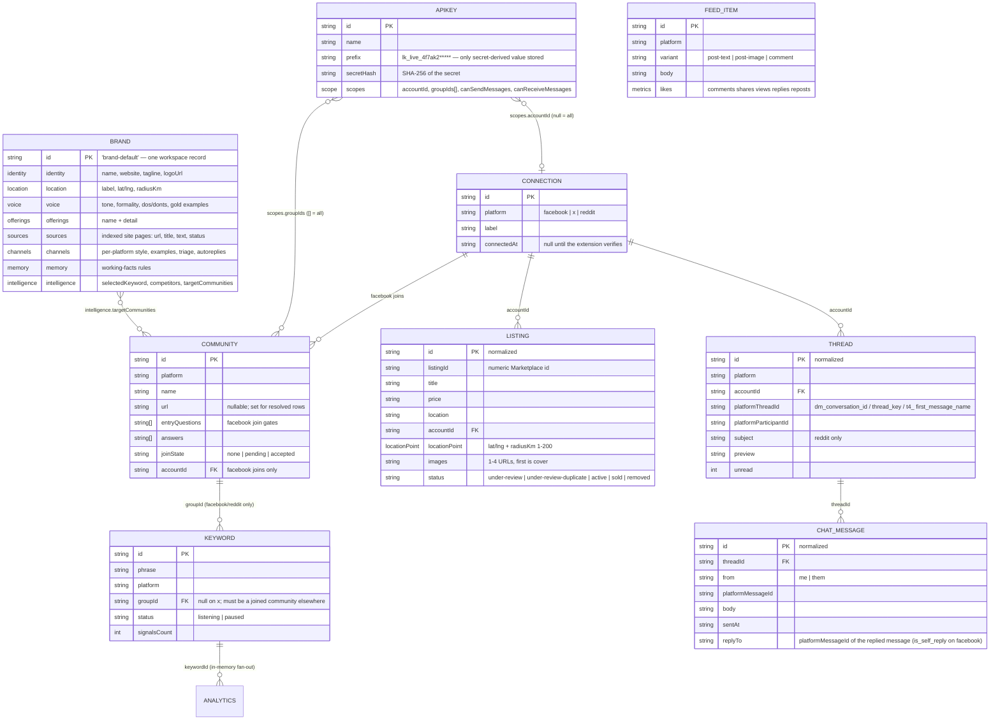

# Architecture & Data Model Reference

This document provides a deep architectural walkthrough of ListeningKit, explaining data models, backend topologies, security boundaries, and the event-driven ingestion engine.

---

## High-Level Architecture

ListeningKit bridges social media platforms (**Reddit**, **X / Twitter**, **Facebook**) with programmatic developer interfaces (**REST API**, **Model Context Protocol / MCP**, **Webhooks**, and **AI scoring**).

Diagram source: [`docs/diagrams/convex-architecture.mmd`](diagrams/convex-architecture.mmd)

---

## Data Model (Entity Relationship Diagram)

ListeningKit models social accounts, communities, keywords, inbound posts, matching signals, and brand identities as structured records:

Diagram source: [`docs/diagrams/data-model-erd.mmd`](diagrams/data-model-erd.mmd)

---

## Core Entities & Schemas

| Entity | Primary Storage | Description |
|---|---|---|
| **`accounts` / `connections`** | `convex/schema.ts` (`accounts` table) | Social accounts connected by the user. Stores encrypted cookie jars (`sessions` table) and connection health status. |
| **`keywords`** | `convex/schema.ts` (`keywords` table) | Exact whole-word search phrases monitored on specific platforms or subreddits. Tracks status (`active`, `paused`) and signal counts. |
| **`posts`** | `convex/schema.ts` (`posts` table) | Normalized social media posts ingested from Reddit, X, or Facebook. Includes metrics (likes, comments, reposts), author, and platform permalinks. |
| **`hits`** | `convex/schema.ts` (`hits` table) | Distinct (keyword, post) matches. Stores match timestamps, score (0-100), intent classification, and explanation reason. |
| **`brands`** | `convex/schema.ts` (`brands` table) | Workspace brand profile containing identity, offerings, tone of voice, indexed sitemaps, and LLM prompt compiler settings. |
| **`apiKeys`** | `convex/schema.ts` (`apiKeys` table) | Developer API credentials with scoped access controls (`read`, `write:phrases`, `webhooks`). Stores only SHA-256 hashes of the keys. |
| **`webhooks`** | `convex/schema.ts` (`webhooks` table) | Configured webhook subscriptions for high-scoring matches. Stores encrypted HMAC secrets and tracks delivery health. |

---

## Security & Privacy Model

### 1. Structural Owner Isolation
Every public Convex query and mutation calls `requireOwner(ctx)`. Owner identity is derived directly from the verified Clerk JWT subject (`identity.subject`). The client is never allowed to pass a user or owner ID as an argument.

### 2. Cookie Encryption at Rest
Social media session cookies are sealed using **AES-256-GCM** with a master key (`SESSION_ENCRYPTION_KEY`) stored exclusively in Convex deployment environment variables. Cookies are never returned by any browser-accessible query; only the authenticated helper endpoint `GET /session` with a matching Ingest Key can receive the decrypted cookie jar.

### 3. API Key & Ingest Key Segregation
- **API Keys (`lk_api_...`)**: Used to access REST endpoints (`/api/v1/...`) and the MCP server (`/mcp`).
- **Ingest Keys (`lk_ingest_...`)**: Used exclusively by local readers to push posts (`POST /ingest`), fetch proxy credentials (`GET /proxy`), and read user sessions (`GET /session`).
- The two key types cannot substitute for each other. Only SHA-256 hashes are stored in the database.

### 4. Untrusted Content Boundaries
Content from external sources (tweets, Reddit comments, Facebook posts, website scrapes) is classified as **untrusted data**:
- In LLM prompts, external content is placed strictly inside fenced `<post>` or `<business>` tags.
- Model replies are clamped and sanitized before storing in the database.
- Webhook endpoints accept only public HTTPS addresses (no localhost, internal IP ranges, or reserved names).

---

## Ingestion Subsystems

### Reddit Ingestion Engine
Reddit is read autonomously in the cloud by Convex scheduled cron jobs (`watch.tick`). It follows a strict fallback priority:
1. **Reddit OAuth Script API** (when `REDDIT_CLIENT_ID` and `REDDIT_CLIENT_SECRET` are configured).
2. **Reddit Public RSS Feed** (`https://www.reddit.com/r/{subreddit}/new.rss`).
3. **Public Reddit Mirror** (if RSS is rate-limited).

### X / Twitter & Facebook Readers
Because X and Facebook deploy aggressive bot countermeasures, reading is executed by local Python adapters (`clients/x_push.py` and `clients/facebook_push.py`) running real Google Chrome via Playwright:
- Emulates realistic human interactions (`humanize=true`, scroll delays, random jitter).
- Operates through the operator-defined upstream residential proxy (`PROXY_URL`).
- Pushes parsed results in structured batches to `POST /ingest`.

---

## Related Diagrams

- [Full Diagrams Index](diagrams/README.md)
- [System Overview](diagrams/system-overview.mmd)
- [API Authentication Sequence](diagrams/api-auth-sequence.mmd)
- [Group Join Flow](diagrams/group-join-flow.mmd)
- [OpenAPI Spec Generation Pipeline](diagrams/openapi-pipeline.mmd)
