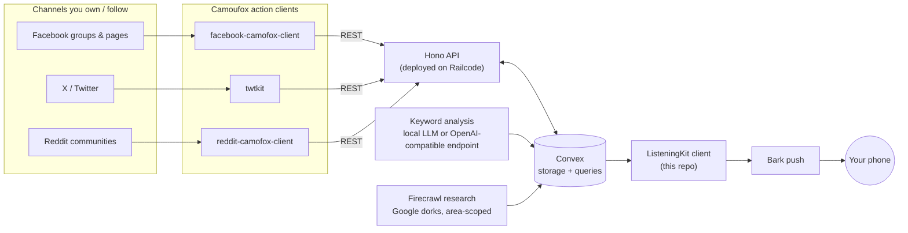
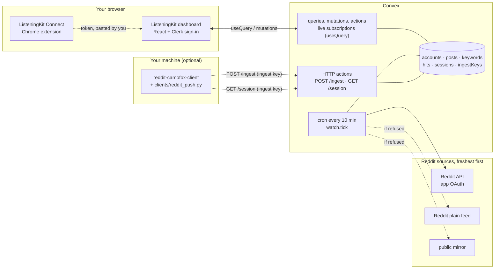
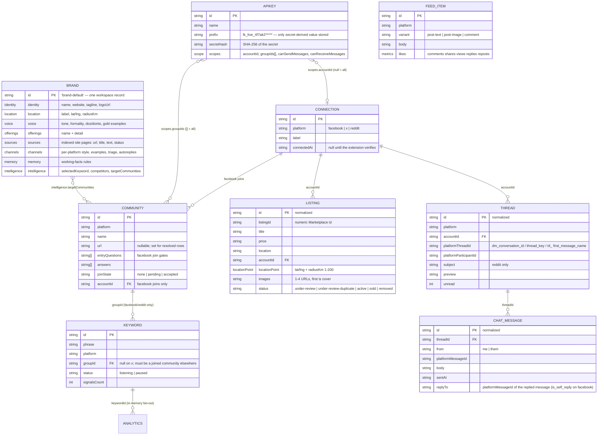
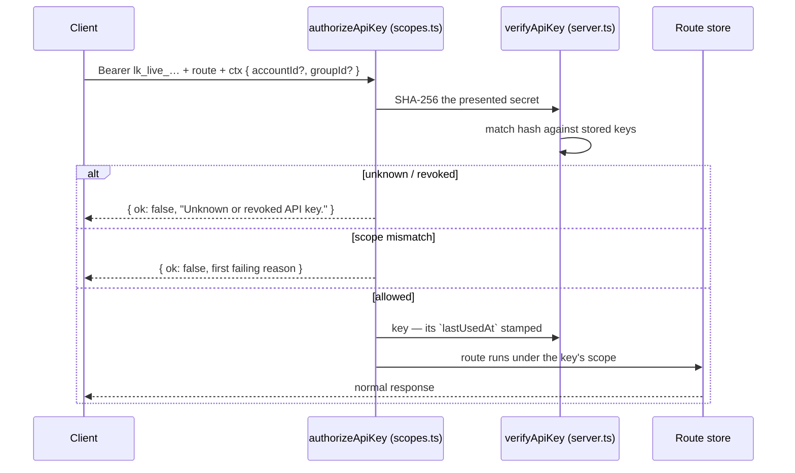
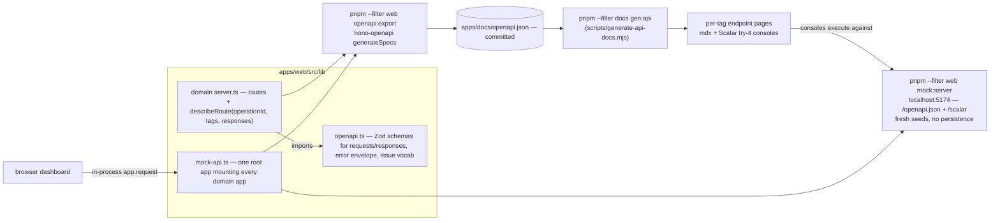
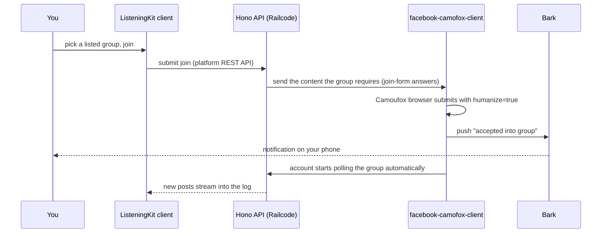
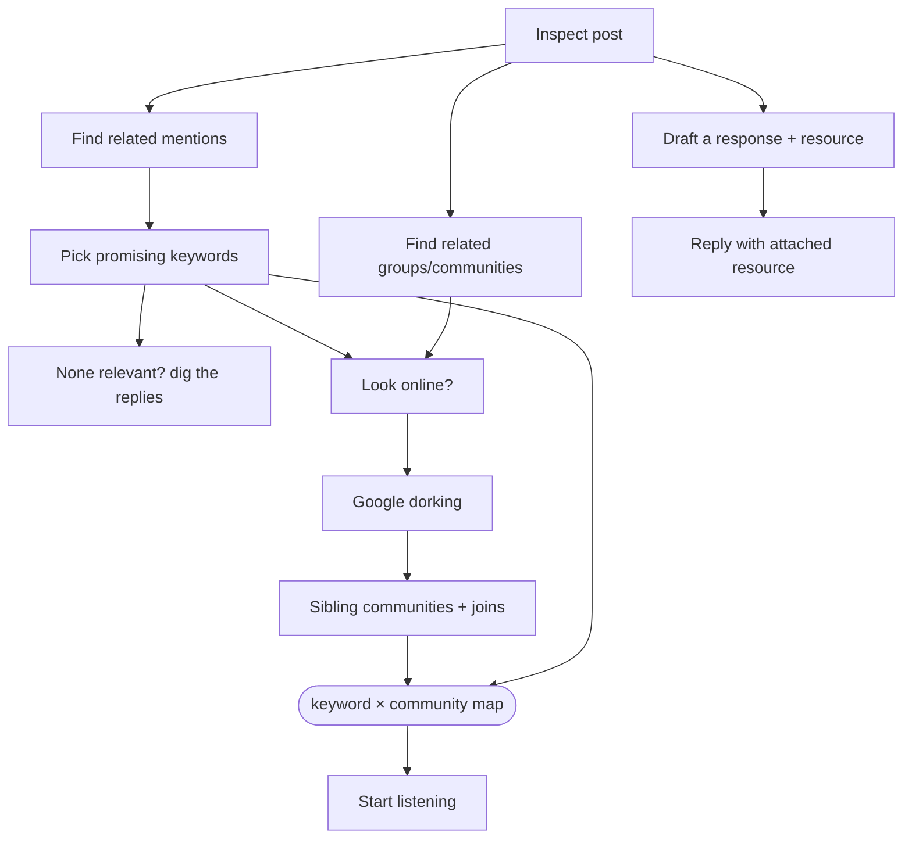
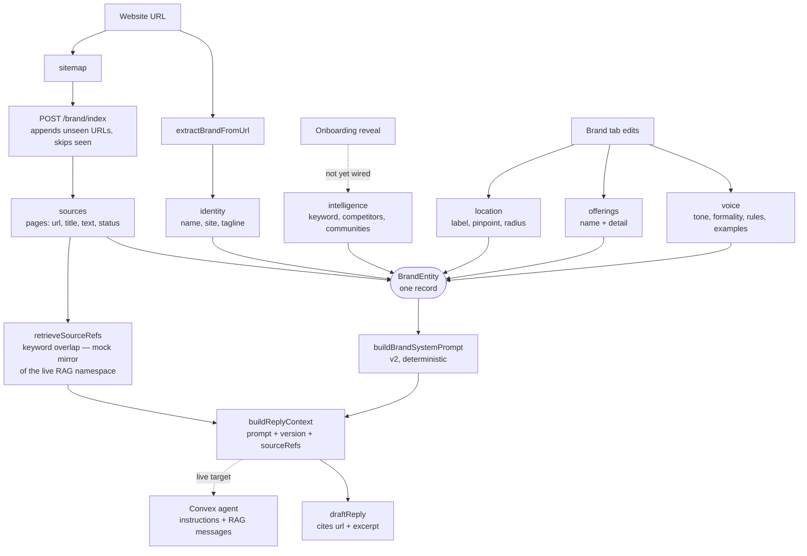
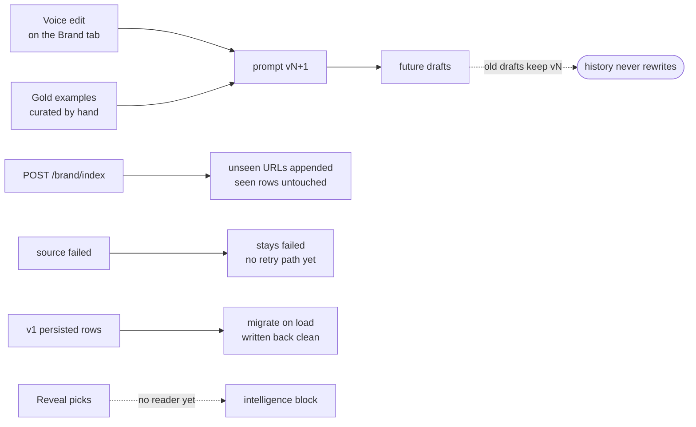

# Architecture & Flow Diagrams

This directory contains domain-separated Mermaid diagrams documenting ListeningKit's end-to-end architecture, data flow, security model, and ingestion pipelines. Each diagram is maintained as a standalone `.mmd` file for modularity and reusability, and rendered below with accompanying documentation.

## Table of Diagrams

| Domain | Diagram | Format | Description |
|---|---|---|---|
| **System** | [System Overview](#1-system-overview) | [`system-overview.mmd`](system-overview.mmd) | High-level topology across channels, Camoufox clients, Hono API, Convex, AI scoring, and push alerts |
| **Backend** | [Convex Live Architecture](#2-convex-live-architecture) | [`convex-architecture.mmd`](convex-architecture.mmd) | Live deployment architecture: React UI + Extension, Convex functions/crons/HTTP, Reddit sources, and local adapters |
| **Data Model** | [Entity Relationship Diagram](#3-data-model-erd) | [`data-model-erd.mmd`](data-model-erd.mmd) | Workspace relationships between Accounts, Communities, Keywords, Listings, Threads, Chat Messages, and Brands |
| **Security** | [API Key Auth Sequence](#4-api-key-authentication-sequence) | [`api-auth-sequence.mmd`](api-auth-sequence.mmd) | Scoped authorization check, SHA-256 secret verification, and route execution gate |
| **Contracts** | [OpenAPI Pipeline](#5-openapi-pipeline) | [`openapi-pipeline.mmd`](openapi-pipeline.mmd) | Single source of truth from Zod schemas to OpenAPI spec, Fumadocs pages, and mock server |
| **Automation** | [Group Discovery & Join Flow](#6-group-discovery--join-flow) | [`group-join-flow.mmd`](group-join-flow.mmd) | Facebook group join lifecycle, humanized form submission, and Bark push notifications |
| **Discovery** | [Keyword & Community Follow-up Loop](#7-keyword--community-follow-up-loop) | [`keyword-followup-loop.mmd`](keyword-followup-loop.mmd) | Post inspection chain, keyword extraction, Google dorking for sibling communities, and map synthesis |
| **Brand** | [Brand Context Pipeline](#8-brand-context-pipeline) | [`brand-context-pipeline.mmd`](brand-context-pipeline.mmd) | Extraction from website URL, sitemap indexing, prompt compiler, and RAG reply context generation |
| **Brand** | [Brand Feedback Loop](#9-brand-feedback-loop) | [`brand-feedback-loop.mmd`](brand-feedback-loop.mmd) | Voice upgrades, versioned prompt immutability, index merges, and gold examples |

---

### 1. System Overview

**File:** [`system-overview.mmd`](system-overview.mmd)

---

### 2. Convex Live Architecture

**File:** [`convex-architecture.mmd`](convex-architecture.mmd)

---

### 3. Data Model ERD

**File:** [`data-model-erd.mmd`](data-model-erd.mmd)

---

### 4. API Key Authentication Sequence

**File:** [`api-auth-sequence.mmd`](api-auth-sequence.mmd)

---

### 5. OpenAPI Pipeline

**File:** [`openapi-pipeline.mmd`](openapi-pipeline.mmd)

---

### 6. Group Discovery & Join Flow

**File:** [`group-join-flow.mmd`](group-join-flow.mmd)

---

### 7. Keyword & Community Follow-up Loop

**File:** [`keyword-followup-loop.mmd`](keyword-followup-loop.mmd)

---

### 8. Brand Context Pipeline

**File:** [`brand-context-pipeline.mmd`](brand-context-pipeline.mmd)

---

### 9. Brand Feedback Loop

**File:** [`brand-feedback-loop.mmd`](brand-feedback-loop.mmd)

