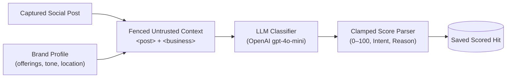
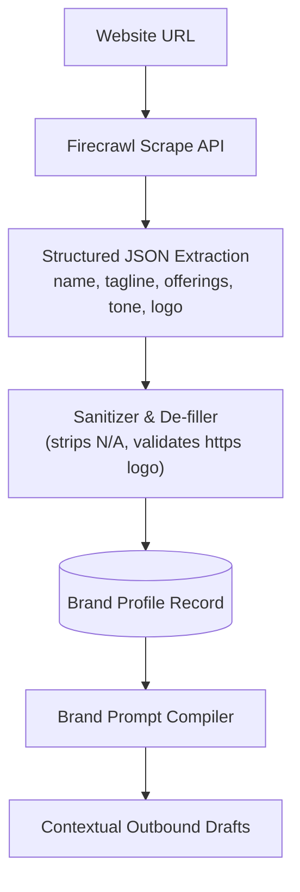
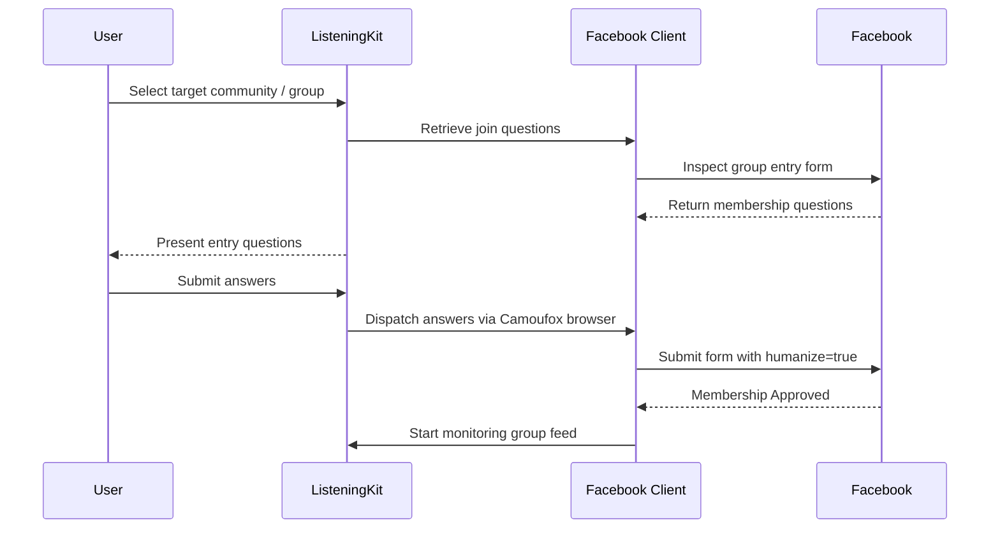

# Features & Subsystems Guide

ListeningKit is designed as an end-to-end platform for automated social intelligence, outbound audience engagement, and community discovery.

---

## 1. Multi-Platform Social Listening

ListeningKit continuously scans for whole-word phrase occurrences across three major platforms:

| Platform | Channel Scope | Ingestion Method | Refresh Cadence |
|---|---|---|---|
| **Reddit** | Subreddits (`r/programming`, `r/startups`, etc.) | Scheduled Convex Crons (`watch.tick`) via Reddit OAuth, RSS, or Mirror | Every 10 minutes |
| **X (Twitter)** | Global tweet stream / search results | Local Python helper (`clients/x_push.py`) with real Chrome browser | Polled with jitter (min 2 min floor) |
| **Facebook** | Public posts & joined groups | Local Python helper (`clients/facebook_push.py`) with real Chrome browser | Polled with jitter |

### Whole-Word Phrase Matching
Matching is performed in real-time as posts are ingested via `convex/lib/match.ts`:
- Exact whole-word boundary matching prevents spurious substring hits (e.g. matching "cat" won't trigger on "scatter").
- Case-insensitive normalization.
- Ingested posts and matched hits are indexed immediately and broadcast live to connected frontends via Convex reactive subscriptions.

---

## 2. AI Scoring & Intent Classification

Raw social media hits are often noisy. ListeningKit scores every incoming hit using an integrated LLM pipeline (`convex/scoring.ts`):

### Scoring Criteria
- **Relevance Score (0–100)**: Evaluates how relevant the author's request is to your specific product or service offerings.
- **Intent Category**: Categorizes the author's mindset (e.g., *Looking for recommendations*, *Experiencing pain point*, *Evaluating competitors*, *Casual discussion*).
- **Concise Reason**: A single sentence explaining why this hit is high or low intent.

### Safety & Guardrails
- **Prompt Fencing**: Post text is treated as strictly untrusted and fenced in `<post>` blocks.
- **Fallback Tolerant**: If the OpenAI API is unreachable or returns malformed text, the post remains unscored without breaking the ingestion pipeline. Up to three retries are attempted.
- **Emergency Killswitch**: Setting `AI_SCORING=off` in Convex immediately halts all external AI calls.

---

## 3. Brand Extraction & Intelligence (Firecrawl)

Setting up a social listening campaign shouldn't require writing hours of configuration. ListeningKit automatically derives your business profile from your website:

- **One-Click Discovery**: Provide a homepage URL during onboarding, and [Firecrawl](https://firecrawl.dev) scrapes the site to extract brand name, value proposition, core services, and tone.
- **Business Summary Injection**: A concise summary of your business is passed along with social posts to the AI scoring prompt, ensuring scores reflect actual product fit.
- **Sitemap Indexing**: `POST /brand/index` indexes subpages to serve as reference citations for draft replies.

---

## 4. Notification Channels

When a high-scoring post is detected, ListeningKit alerts you through your preferred channels:

### 1. AgentMail Email Digests
- Configured under **Settings** > **Notifications**.
- Periodic cron (`alerts:sweep`) aggregates high-scoring matches.
- Sends clean, plain-text emails via the [AgentMail](https://agentmail.to) API.
- Guardrails: Maximum 5 matches per email, maximum 1 email per user every 10 minutes, deduplicated so you never receive the same hit twice.

### 2. Bark Mobile Push Notifications
- Directly pushes alerts to your iPhone or iPad via [Bark](https://bark.app).
- Instant notification when a tracked phrase appears or when a Facebook group join request is accepted.

### 3. Signed Outbound Webhooks
- Pro-grade programmatic event dispatch for downstream automations (Slack bots, Zapier, internal CRM).
- Includes HMAC-SHA256 signatures for authenticity verification.

---

## 5. Group Discovery & Autonomous Joining

On platforms like Facebook, many of the most valuable buying conversations occur inside private or semi-private groups:

- **Dynamic Question Answering**: Handles complex multi-question join gates with custom answer persistence.
- **Humanized Browser Submission**: Submits join answers through Playwright Chrome with randomized mouse movement and typing cadence to prevent spam flags.
- **Auto-Listen on Acceptance**: The moment group membership is accepted, ListeningKit's crawler automatically begins monitoring the group's feed.

---

## 6. Follow-up & Response Synthesis

Every detected mention includes actionable next steps in the dashboard:
- **Inspect Post**: Examine author history, metrics, and engagement.
- **Suggest Sibling Keywords**: Discover related terms the community uses to describe the problem.
- **Find Sibling Communities**: Use Google dorking operators to locate related subreddits and Facebook groups.
- **Draft Tailored Response**: Generates a respectful, contextual response in your brand's voice with a reference link to relevant documentation or blog posts on your site.
